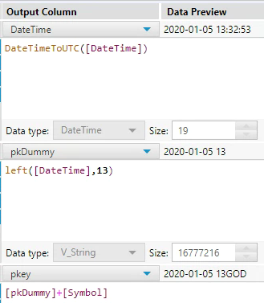
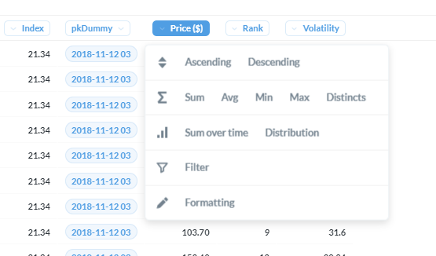
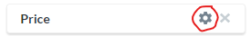
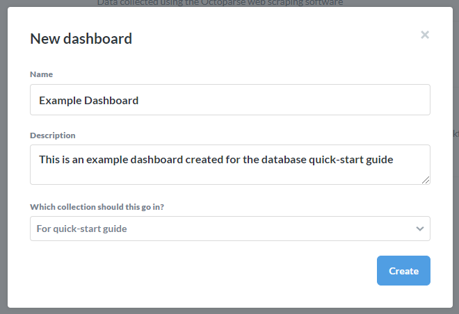
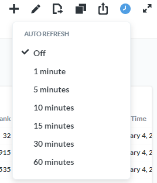
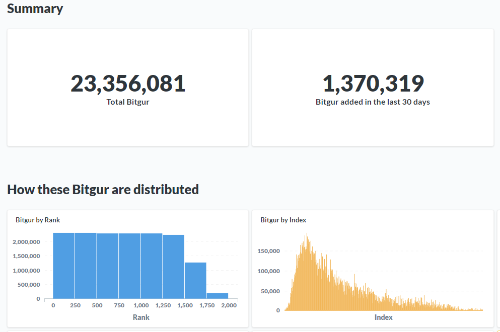

# Usage Guide
Now that you've familiarized yourself with the tables found in the [previous section](#useful-tables), this next section is going to help you understand how to pull data out of the database and how to join different tables together and being able to put that all together in more useful formats and outputs.

## Answer *Questions*
We now have a specific table in mind that we are looking to analyze, and maybe even a specific analysis in mind. To get started, click on the option in the top right **Ask a question**:

Here, you will be given three different options:

1. **Simple question**

    + After choosing your table you will be brought to an interactive view of the data. See the [section about tabular data](#tabular-data) for more information around using this methodology.

2. **Custom question**

    + When picking this option, the underlying functionality is similar to what is given on the simple question option, but when doing a custom question the data won't 

3. **Native Query**

    + If you're comfortable in SQL and you find that the Metabase interface just gets in the way, feel free to write your own raw SQL code by selecting this option. I have limited the Metabase environment to only allow for `SELECT` statements, if you need additional privileges send me an e-mail.

In summary, if you are not familiar with a table and you're looking to explore the data as you filter different values and whatnot, you will probably want to pick the *Simple question*. If you have a specific analysis in mind already (e.g. last 7 days prices for ETH sorted by DateTime), you might get to your answer faster making a *Custom question* so you're waiting less for the data to load. If you are looking to write your own SQL directly instead of using the Metabase environment to help explore the data in a more intuitive way, go ahead and use the *Native Query* option.

### Exporting Data

Before going over how to export the data, just a quick word about the confidentiality of the data. Over time I have grown to like the idea of making this data more accessible rather than keeping it as private as possible, **BUT** I have spent a lot of money and time working on this and I would like any type of sharing of the data to go **through me** for now. Feel free to download as much data out of the database as you would like, just **please** do not share this data with people who I haven't explicitly given access to. To get someone access, please have them e-mail me at riccardo.esclapon@colorado.edu directly.

- In order to export the data you are pulling through Metabase, you would press the *Download* button in the bottom right of the page:

    
    
    - When you are working within Metabase, if your results produce more than 2,000 rows, you would only see a preview of the first 2,000 rows. When you download the results however, you will download the full results of your query up to a million rows. 
    
        - For example, if you were doing a raw SQL query `SELECT * FROM Bitgur` in the Octoparse database, you would see the first 2,000 rows of the Bitgur raw data, but if you were to click on the Download button, you would be downloading the first 1,000,000 rows from the Bitgur dataset (since it has more than 1 million rows). If you adjusted the query to be `SELECT * FROM Bitgur ORDER BY Date DESC` and you clicked Download, you would be extracting the most recent 1,000,000 rows of data out of the database.
        
        - If you are looking to train a model or do something that requires you to extract more than 1,000,000 rows and you are having a hard time with that limit send me an e-mail.
        

## pkey and pkDummy fields

Let's say you went ahead and trained a predictive model using the data found in the database and now you want to test making some *semi-live* predictions, how would you go about pulling the latest data to make predictions on?

**A row is uniquely identified by the individual cryptocurrency symbol, and the date and hour of when the data was collected.** All tables were given values that help uniquely identify a data point. All these values are doing, is taking the two values that uniquely identify a row in the dataset and saving the result in a new field called `pkey`. 

1. The first step to calculating the `pkey` field is to create a field called `pkDummy`, which is a string that gives the Date and the hour of the day, but no information about the minutes or seconds. For example, if the DateTime of when the data was extracted is *2020-01-01 10:03:53*, the resulting value found within the `pkDummy` field would be ***2020-01-01 10***. 

2. Once the `pkDummy` field is being properly populated, there is a generated column that is found within all tables called `pkey`, which is calculated through this formula: ***concat(`pkDummy`,`Symbol`)***, meaning the example from earlier would have the following `pkey` for the row associated with Bitcoin: ***2020-01-01 10BTC***. 

3. You can now **use the `pkey` 2020-01-01 10BTC in order to join data from a different table that was also collected on January 1st, 2020 at 10am by a different table**. Keep in mind that these joins will not be perfect because the data will inevitably differ in terms of when it was specifically collected. Every table also has a field showing the full DateTime of when the data was extracted, so always keep an eye on that field and make sure the data you are joining was collected no longer than a couple of minutes apart.

4. If you are looking to pull the latest/live data from the current hour, take the maximum of the pkDummy field `max(pkDummy)`.

    + In my experience this works fine, but if the data type ends up giving problems I can convert this to a big integer with no dashes and the order of the numbers would then work (e.g. 2020010110 > 2019123010).

- **Important Note:** Only do this for tables that are found within the same database! Currently, you can only use the pkey to tie information from tables found within the Octoparse database to other tables within the Octoparse database, and ***not*** the ScrapeStorm database. This is because the data that flows into the Octoparse database **is always recorded with the UTC timezone**, while the data that flows into the ScrapeStorm database **is always in the MST Colorado timezone**. Because MST has daylight savings and UTC does not, there is no hard-coded adjustment that can be applied here, like subtracting 6 hours. 

    - The only effective way that I found to properly adjust the timezones and to enable a join between the different databases is by using the Alteryx formulas `DateTimeToLocal()` and `DateTimeToUTC()`:
    
        
        
    - After making this adjustment to the table you are looking to join, you would need to apply the adjustment to the pkDummy and pkey fields as well, since those are whate gets used for the join and not the raw DateTime field.
    
        
    
    - In this case we are adjusting the pkey for a table found in the ScrapeStorm database that we want to join to data found in the Octoparse database, because we are going from MST time (associated with ScrapeStorm db) to UTC time (associated with Octoparse db).

<!-- If you are looking to join all data from a specific date and hour, you could use the `pkDummy` field for your join instead of the `pkey`, but be aware of how this is going to *explode* your dataset and make it much larger in some cases. -->

## Tabular Data
Within Metabase when you start working with a table, you will usually see a preview of the raw data. From there, you have several options in terms of what you can do apart from [exporting the results](#exporting-data).

- The first thing I want to point out, is that you can click on each field to open a menu with an assortment of options based on the data type. For example, if we click on the **Price** field, these are the options we are given:

    

    + The Date field is a different data types and offers different options. For example we could sort the data by the **Date** field **Descending**:
    
        
    
        + Which would return the first 2,000 rows again but this time sorted showing the largest values first (meaning the latest date):
        
            )](images/DateDescendingOutcome.png)

- Next, let's click on the purple `Filter` button in the top right of the page:

    
    
    - Now you should see the following sidebar pop-up:
    
        
    
        + Let's do a quick example filtering based on the **DateTime** field:
        
            
        
            + Let's add a filter to only select data where the **DateTime** field is from the last 7 days:
            
            
            
         
- Now that we have filtered the data down to the subset we are interested in, we could adjust the look of the table using the `Settings` option in the bottom left:

    
    
    <!-- + After clicking on the `Settings` button, you should see a sidebar show up on the left. First, let's edit the settings for the **Price** field: -->

    <!--      -->

    <!--     + And let's set the currency to be displayed with every cell instead of in parenthesis in the column name: -->

    <!--          -->

    <!--         + Now the currency field will look like this for each row: -->

    <!--          -->

    <!-- + Let's also do a quick edit to the **Volatility** field settings: -->

    <!--      -->

    <!--     + Enable the setting to `Show a mini bar chart`: -->

    <!--      -->

    <!--     + Now each row should have a bar that is filled based on the current value compared to the minimum and maximum values for that field for the current subset of the data: -->

    <!--          -->

    <!--         + If we sort the data by **Volatility** in *descending* order, we can see the row that sets the bar for the maximum for the rest of the rows: -->

    <!--          -->

    <!--      + Now let's also add some conditional formatting to the **Volatility** field, which will color each row when a certain criteria is met. Go back to the `Settings` page of the table, and this time click on `Conditional Formatting`: -->

    <!--           -->

    <!--          + Now we can create a rule to highlight rows with a value for **Volatility > 50**: -->

    <!--           -->

    <!--          + The table's rows should now be highlighted when the criteria is met: -->

    <!--           -->

### Creating Visualizations
If you are looking to create a visual representation of the data, you can do so by pressing on the button in the bottom left of the page:

- For a complete description of all visualization options, please see the **excellent** official Metabase documentation on the topic: [https://www.metabase.com/docs/latest/users-guide/05-visualizing-results](https://www.metabase.com/docs/latest/users-guide/05-visualizing-results)

## Creating dashboards

- Start by clicking on the `+` sign in the top right of the page and selecting the option *New Dashboard*:

    
    
- When prompted fill out the Name and Description for the table and create the dashboard:

    
    
- Now you will need to start adding questions to your dashboard:

    
    
- Add as many questions as you want to your dashboard and create whatever layout you would like.

- Once you're finished adding questions, add a filter shared by the dashboards. To do this, first enter the *Edit* mode of the dashboard, and select the *Filter* option:

    

    - For example, you could be showing the last 7 days of data for Ethereum only across all questions (tables/charts) being shown on the dashboard:
        
        

- You can set the dashboard to auto-refresh on a schedule as well:
    
    

### Example dashboard
[Click here for a very simple example](https://predictcryptodb.com/dashboard/1) of a dashboard.

## Using x-rays to explore a table

In the previous sections we have gone over how you would start to understand the fields collected by a table, but we haven't talked too much about exploring the actual values found within a table. For example, we might be able to have a good sense of what the field *Volatility* may mean, but we wouldn't get a good understanding of the range of values for that variable and it's distribution.

A really good way to answer these questions, is by taking an `x-ray` of the table. When taking an *x-ray* of a table Metabase does a quick scan of the values found within the table and creates a preview of those values. It will tell you the total number of rows found in the table, the number of new rows in the past 30 days, a distribution of the values for each variable in the table, and a preview of how the values have changed over time:

    

The database does not have nearly as many dedicated resources as a database at a big company would in order to stay as cost-effective as possible, but if you stay patient usually Metabase is able to create an x-ray of the table, and when you go back to it later on it should take less to load because it is able to retrieve some cached data.

## Sharing

- Once you have created something like a dashboard that auto-refreshes periodically, it can be shared with others as a private link, or be embedded directly within a website. Almost everything you create in the Metabase environment should have a *Share* button, that on hover says *Sharing and embedding*:

    

- Once you press the button, you'll have the option of enabling or disabling a link that can be used to publicly access this information **without** a login. **Please be mindful of the privacy of the data whenever you share anything, and when in doubt just shoot me a message.**

