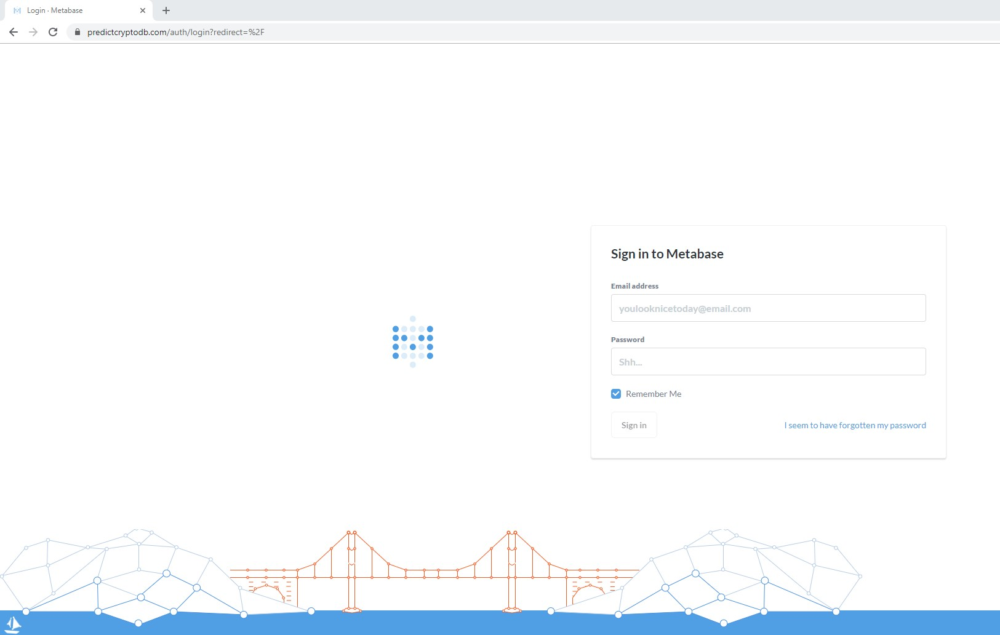

# Interacting with the DB

First off, why the heck is there a website? If there's a database that lives somewhere in the cloud why wouldn't you access it through a SQL editor like SSMS or MySQL? Let's start with the benefits of having this environment readily available to access through a website before jumping into how to start interacting with the database.

## Benefits
- Giving access to the database can be challenging, and having a centralized server that can be accessed through a website allows us to analyze the data without worrying about individual IP addresses being allowed access and other issues we would run into relating to authentication without this type of environment to work out of.

- There is no setup required on your part to start working with the database and as soon as your account is setup you can start writing SQL queries through the website and log into the website at any time. 

- You can access the Metabase interface to interact with the database from any device, like a tablet or smartphone.

- It works as a shared environment where we can all collaborate and see each other's dashboards, sql queries, visualizations etc... This is similar to the way a Tableau Online website would work within an organization.

- Makes creating dashboards to visualize the data extremely simple. Those dashboards can then be shared and be embedded, and the data can be refreshed on a schedule in a matter of clicks.

## "Metabase" explained 

First, let me clarify on what I mean by *Metabase* and how this all works. 

1. [Metabase](https://www.metabase.com/) is the name of the open source software that we are using to interact with the database.

2. Using the [docker container available to download on Metabase's website](https://hub.docker.com/r/metabase/metabase/), I stood up a server-type environment in AWS that hosts the Metabase instance that is connected to the database.

3. The AWS environment running the Metabase instance can be connected to by opening your web browser and navigating to the https secured website [predictcryptodb.com](https://predictcryptodb.com). From here, you will use the set of credentials that you created after clicking on the invitation from the e-mail you received. If you need an invite to create a set of credentials, e-mail me at riccardo.esclapon@colorado.edu.

## Logging In

1. To get started, the first thing you will want to do every time is go to the URL [predictcryptodb.com](https://predictcryptodb.com). You should see a login page:

    
    
    + If you are having issues accessing the website, try spelling the url including [***https://***predictcryptodb.com](https://predictcryptodb.com). 

2. Before you can login, you need to configure your account through the e-mail you should have received. If you did not receive the e-mail, check your spam folder first:

    
    
    + Configure your password and you will be able to use your e-mail and password to login in the future:
    
    

3. Once you have logged in, you should see a page that looks like this:

    

In the next section we will talk about some good tables to get started on, and getting more comfortable navigating the layout of the website.

