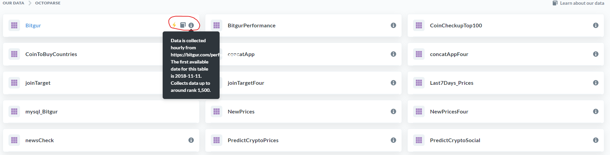
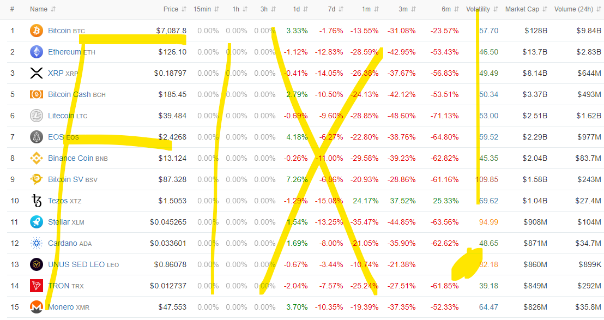

# Useful Tables

## Browse Data

Let's start by clicking on the `Browse Data` tab in the top right of the Metabase environment:

Here, you will see two different options:

- `Octoparse` is the schema that is associated with data I have collected by using the *Octoparse* web scraping software.

- Conversely, `ScrapeStorm` is the schema associated with data collected using the *ScrapeStorm* web scraping software.

- Web scraping has its challenges in terms of stability, so I built some additional resilience by using two different tools that work independently of each other and do similar things (and in some cases collect the same data). Although not a perfect solution, having both up and running means we can usually fill the gaps that might arise in each tool respectively.

    + The web scrapers that are run through Octoparse run on their servers in the cloud, which are very stable but have had some issues here and there in the past.
    
    + The web scrapers that are run through ScrapeStorm run on a local machine on my end. I have a computer in the cloud that runs 24/7 but even after upgrading the hardware on it ScrapeStorm kept crashing, so this currently runs on my powerful desktop computer that is always on at home. When these run, the data flows in almost immediately, meaning if it's 4:05PM and you pulled the latest hour of data (which would be equivalent to the `max(***pkDummy***)`, more to come on that later on)

**Let's click on the one that says `Octoparse` first:**

Now you should see the tables that are contained within the `Octoparse` schema. By hovering over each table, you will see three options appear, which will be better explained in the [next section about *Documentation Usage*](#documentation-usage)

## Data Exploration

### Exports

(make note about confidentiality)

## Some other useful tables

- **`Bitgur Performance`**

    + This table is very similar to the `Bitgur` table we reviewed at the end of the last section, but this one includes some fields that summarize the short-term performance of the cryptocurrency in the short-term relative to when the data was collected:
    
    
    
    + Data collected since:
    
    + Row count as of 12/19/2019:
    
    
- ***`ScrapeStorm.ShrimpyPrices`***

    + When using data from a table like the `Bitgur Performance` table just described, that data is aggregared at a global level. Meaning, the Bitgur website connects to a certain number of exchanges, and calculates things like the overall Market Capitalization ($), the 24h volume, etc. When it comes to the price, the website will average things across exchanges to get to the current price, which makes sense, but in my experience this is not as precise as it needs to be in order to programmatically trade on the cryptocurrency markets.
    
    + Therefore, a better approach is to collect the prices directly through the individual exchanges. Because I setup my trading system to work through a service called **Shrimpy**, I have been collecting prices for each exchange as reported through the Shrimpy website. This for example would be the page for the KuCoin exchange prices:
    
    
    
    

- ***`ScrapesStorm.ShrimpyPricesBTC`***

    

(if there are any tables that start with *AYX* please ignore these tables as they are artifacts of temporary tables made through Alteryx that were supposed to be deleted) - issue resolved?
