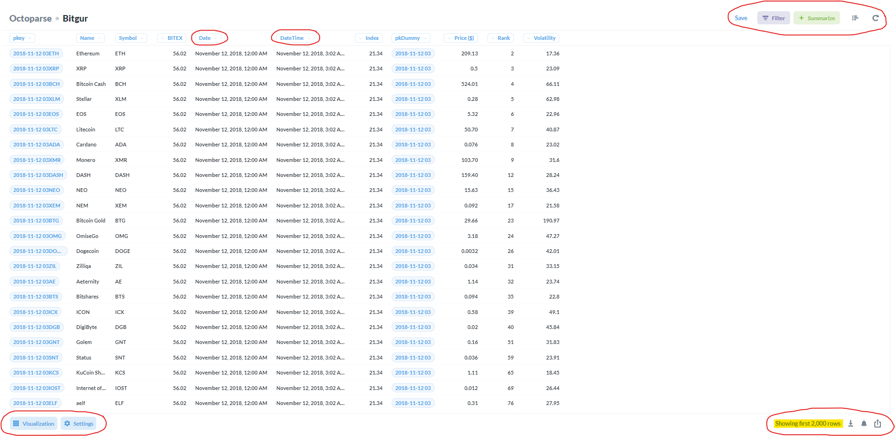

# Useful Tables

```{r dbConnect, echo=F, warning=F}
library(DBI)
library(RMySQL)
library(data.table)
library(knitr)
library(rmarkdown)
library(DT)
library(reticulate)

############# SQL CONNECTION ###############
getSqlConnection <- function(){
  con <-
    dbConnect(
      RMySQL::MySQL(),
      username = Sys.getenv('user'),
      password = Sys.getenv('pswd'),
      host = Sys.getenv('ipAddress'),
      dbname = 'Octoparse'
    )
  return(con)
}

database_connection <- getSqlConnection()
tables_list <- dbListTables(database_connection)

query <- 'SELECT table_schema "DB name", sum( data_length + index_length ) / 1024 / 1024 "Size in MB", curdate() as Today 
FROM information_schema.TABLES GROUP BY table_schema 
ORDER BY `Size in MB` desc limit 2'

tables_summary <- dbFetch(dbSendQuery(database_connection, query))
```

In this section we will be reviewing some interesting tables and good places to get started.

## Browse Data

Let's start by clicking on the `Browse Data` tab in the top right of the Metabase environment:


Here, you will see two different options:


- `Octoparse` is the schema that is associated with data I have collected by using the *Octoparse* web scraping software.

- Conversely, `ScrapeStorm` is the schema associated with data collected using the *ScrapeStorm* web scraping software.

- You should also see an option for `PredictCryptoPredictions`. This schema does not have much in it today, but over time as I do more predictive modeling it will populate with new tables for new predictive models and is used to simulate model performance before starting to programmatically trade using the predictions. This guide ignores this schema/database for now to focus on the raw data itself, which always comes from `Octoparse` and `ScrapeStorm`.

- Web scraping has its challenges in terms of stability, so I built some additional resilience by using two different tools that work independently of each other and do similar things (and in some cases collect the same data). Although not a perfect solution, having both up and running means we can usually fill the gaps that might arise in each tool respectively.

    <!-- + The web scrapers that are run through Octoparse run on their servers in the cloud, which are very stable but have had some issues here and there in the past. -->

    <!-- + The web scrapers that are run through ScrapeStorm run on a local machine on my end. I have a computer in the cloud that runs 24/7 but even after upgrading the hardware on it ScrapeStorm kept crashing, so this currently runs on my powerful desktop computer that is always on at home. When these run, the data flows in almost immediately, meaning if it's 4:05PM and you pulled the latest hour of data (which would be equivalent to the ***`max(pkDummy)`***, more to come on that later on) -->

**Back in MetaBase, let's click on the option that says `Octoparse`:**


- Now you should see the tables that are contained within the `Octoparse` schema. By hovering over each table, you will see three options appear, which will be better explained in the [next section about *Documentation Usage*](#documentation-usage). In the screenshot the mouse is hovering over the `i` symbol for the Bitgur table:

    

    - By clicking on the middle button that says *Learn more about this table*, you will be brought to its documentation:
    
        

For now, let's go ahead and click on the name of the table `Bitgur`:


After clicking on the table name, you should see some example data show up. This shows the first 2,000 rows of data found in the table:



In the next section [Usage Guide](#usage-guide) we will walk through some of the functionality associated with the things circled in red in the screenshot above using the Bitgur table as an example.


## Useful tables
- For the previews below, keep an eye out for a button to show more columns:


- Things will tend to live as chr/strings within the database because I found that saving everything as a string prevents schema conflicts from no longer uploading data to the database after it gets collected. The previews below will show you the data types as well, so just keep in mind you might have to change some data types after extracting the data from the database.

### Tables in `Octoparse` db


#### [**`Bitgur`**](https://predictcryptodb.com/question/6)
Bitgur is a website that aggregates cryptocurrency prices and offers tools to analyze the cryptocurrency markets by connecting directly to the API of the different exchanges in a very similar way to the way the most famous website in this space [CoinMarketCap](coinmarketcap.com) does. It's important to note however, that CoinMarketCap connects to 306 exchanges and Bitgur connects to only 56 exchanges (as of 01/01/2020); this results in dramatically different values in terms of volume, but the price and market capitalization would track very closely between the two websites. I don't currently scrape data from CoinMarketCap because they prohibit this type of behavior in their website usage terms in order to sell an extremely expensive API.

```{r BitgurPreview, echo=F}
options(scipen=999) #get rid of scientific notation 

query <- "SELECT * FROM Bitgur limit 5"
# this better but takes longer: 
#query <- "select * from Bitgur where Rank > 0 order by pkDummy desc, rank asc limit 5"

paged_table(dbFetch(dbSendQuery(database_connection, query)))
```
- Source: [https://bitgur.com/](https://bitgur.com/)

- Data collected since: 2018-11-11

<!-- - Number of rows:  -->
<!-- ```{r BitgurOctoparseRowsSummary, echo=F} -->
<!-- query <- "SELECT TABLE_ROWS as 'Rows', NOW() as 'Checked on' FROM INFORMATION_SCHEMA.TABLES Where (TABLE_SCHEMA = 'Octoparse'and TABLE_NAME = 'Bitgur')" -->

<!-- dbFetch(dbSendQuery(database_connection, query)) -->
<!-- ``` -->

#### [**`BitgurPerformance`**](https://predictcryptodb.com/question/7)
```{r BitgurPerformancePreview, echo=F}
query <- "SELECT * FROM BitgurPerformance limit 5"
# this better but takes longer: 
#query <- "select * from BitgurPerformance where Rank > 0 order by pkDummy desc, rank asc limit 5"

paged_table(dbFetch(dbSendQuery(database_connection, query)))
```
    
- This table is very similar to the `Bitgur` table, but this one includes some fields that summarize the short-term performance of the cryptocurrency in the short-term relative to when the data was collected. 
       
- The normal `Bitgur` table would have the prices fields, but not information about the performance over the previous 1h, 3h, etc..
    
- Source: [https://bitgur.com/performance](https://bitgur.com/performance)
        
- Data collected since: 2019-11-05


#### [**`CoinCheckup`**]()


#### [**`Prices`**]()


#### [**`CoinToBuy`**]()


#### [**`TechnicalAnalysis`**](https://predictcryptodb.com/question/10)
This web scraper collects data from the website [Investing.com](https://www.investing.com/crypto/). This website offers free Technical Analysis indicators on traditional markets, and they adapted that for the cryptocurrency markets. In order to get a full summary of the Technical Analysis outlooks, the web scraper needs to iterate through each cryptocurrency individually, and this is one of the few web scrapers that takes too long to run every hour. 

```{r TechnicalAnalysisPreview, echo=F}
options(scipen=999) #get rid of scientific notation 

query <- "SELECT * FROM TechnicalAnalysis limit 5"
# this better but takes longer: 
#query <- "select * from TechnicalAnalysis where Rank > 0 order by pkDummy desc, rank asc limit 5"

paged_table(dbFetch(dbSendQuery(database_connection, query)))
```
- Source: [https://www.investing.com/crypto/](https://www.investing.com/crypto/)

- Data collected since: 2018-11-15


### Tables in `ScrapeStorm` db
    
#### [**`ScrapeStorm.ShrimpyPrices`**](https://predictcryptodb.com/question/8)

- When using data from a table like the `BitgurPerformance`, the data is aggregared at a global level. Meaning, the Bitgur website connects to a certain number of exchanges, and calculates things like the overall Market Capitalization ($), the 24h volume, etc. When it comes to the price, the website will average things across exchanges to get to the current price, which makes sense, but in my experience this is not as precise as it needs to be in order to programmatically trade on the cryptocurrency markets.
    
    + Therefore, a better approach is to collect the prices directly through the individual exchanges. Because I setup my trading system to work through a service called **Shrimpy**, I have been collecting prices for each exchange as reported through the Shrimpy website. This for example would be the page for the KuCoin exchange prices:

```{r ShrimpyPricesPreview, echo=F}
query <- "SELECT * FROM ScrapeStorm.ShrimpyPrices limit 5"
# this better but takes longer: 
#query <- "select * from ScrapeStorm.ShrimpyPrices where Rank > 0 order by pkDummy desc, rank asc limit 5"

paged_table(dbFetch(dbSendQuery(database_connection, query)))
```
    
- Source: [https://www.shrimpy.io/exchange](https://www.shrimpy.io/exchange)

    

- Data collected since: 


#### [**`ScrapesStorm.ShrimpyPricesBTC`**](https://predictcryptodb.com/question/9)

This table is exactly like the previous one `ShrimpyPrices`, but this one shows prices in BTC instead of being in USD.

```{r ShrimpyPricesBTCPreview, echo=F}
#query <- "SELECT * FROM ScrapeStorm.ShrimpyPricesBTC limit 5"
# this better but takes longer: 
query <- "select * from ScrapeStorm.ShrimpyPricesBTC order by pkDummy desc limit 5"

paged_table(dbFetch(dbSendQuery(database_connection, query)))
```

- Source: [https://www.shrimpy.io/exchange](https://www.shrimpy.io/exchange)

- Data collected since: 


<!-- ### Tables for predictive models -->
<!-- - For the PredictCrypto project, I have been working on different iterations of the predictive models to predict and trade on the live cryptocurrency markets. For an overview of what this process looks like from start to finish, please see the **Alteryx Use Case** for the project: [https://community.alteryx.com/t5/Alteryx-Use-Cases/Predicting-and-Trading-on-the-Cryptocurrency-Markets-using/ta-p/494058](https://community.alteryx.com/t5/Alteryx-Use-Cases/Predicting-and-Trading-on-the-Cryptocurrency-Markets-using/ta-p/494058) -->

<!-- - As I improve things on the predictive modeling side of things, I am going to create different iterations of the model and write out predictions made in real time by the newest models and save those predictions so I can analyze what would have happened by actually trading on them. -->

<!-- - Currently   -->


### Database size info

**Size in MB of both the `Octoparse` database and the `ScrapeStorm` db as of the last time this document was refreshed (updated daily):**
```{r showTableSummary, echo=F, warning=F}
kable(format(tables_summary, big.mark = ",",nsmall = 2))
```

**Number of rows by table:**
```{r showTablesSummary, echo=F, results='asis'}
query <- "SELECT TABLE_SCHEMA as 'Database', TABLE_NAME as 'Table Name', TABLE_ROWS as 'Rows' FROM INFORMATION_SCHEMA.TABLES Where (TABLE_SCHEMA = 'Octoparse' or TABLE_SCHEMA = 'ScrapeStorm') and TABLE_ROWS > 1 and UPDATE_TIME > DATE_SUB(NOW(), INTERVAL 5 DAY) Order by Rows desc, UPDATE_TIME desc"

kable(format(dbFetch(dbSendQuery(database_connection, query)), big.mark = ","))
```


