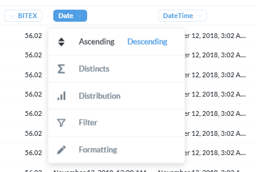
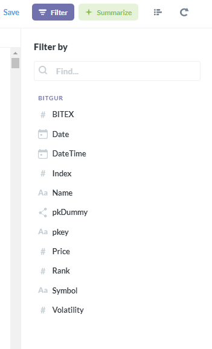
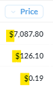
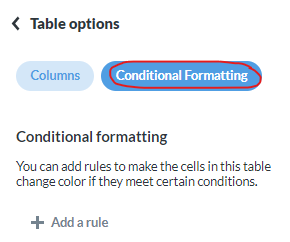
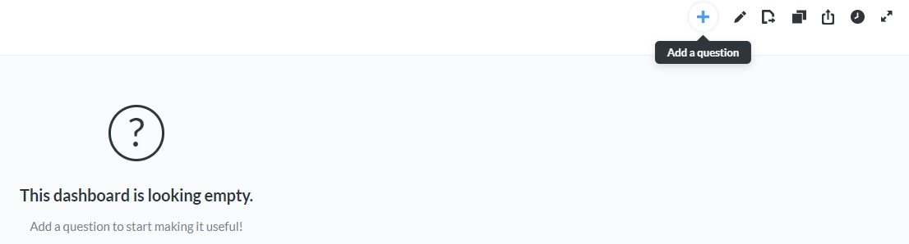
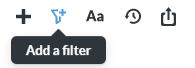

# Usage Guide

## Pulling Most Recent Data

Let's say you went ahead and trained a predictive model using the data found in the database and now you want to test making some *semi-live* predictions, how would you go about pulling the latest data to make predictions on?

- pkDummy

- pkey

Make a note that can't do this between different schemas because the Octoparse one is in UTC and the ScrapeStorm one in local time. Only real effective way I found do to that is through Alteryx tools.

### Joining data using pkey

- Alteryx trick to deal with the trickiness of UTC not having daylight savings and our local times having it

### Example dashboard

### Exporting Data

(make a note about confidentiality of the data)

Talk about how once you've created a table/question of sorts you can download it using the download button. Next section discusses creating 

## Creating Tables (FIX)
FIX THIS BY CENTERING AROUND A TASK LIKE CREATING A TABLE WITH LIVE DATA TO DOWNLOAD EASILY WHENEVER WE WANT TO

Let's explore some of the functionality found in Metabase using the `Bitgur` table results page we got to at the end of the previous section. 

- The first thing I want to point out, is that you can click on each field to open a menu with an assortment of options based on the data type. For example, if we click on the **Price** field, these are the options we are given:

    

    + The Date field is a different data types and offers different options. For example we could sort the data by the **Date** field **Descending**:
    
        
    
        + Which would return the first 2,000 rows again but this time sorted showing the largest values first (meaning the latest date):
        
            )](images/DateDescendingOutcome.png)

- Next, let's click on the purple `Filter` button in the top right of the page:

    
    
    - Now you should see the following sidebar pop-up:
    
        
    
        + Let's do a quick example filtering based on the **DateTime** field:
        
            
        
            + Let's add a filter to only select data where the **DateTime** field is from the last 7 days:
            
            
            
         
- Now that we have filtered the data down to the subset we are interested in, we could adjust the look of the table using the `Settings` option in the bottom left:

    
    
    <!-- + After clicking on the `Settings` button, you should see a sidebar show up on the left. First, let's edit the settings for the **Price** field: -->

    <!--      -->

    <!--     + And let's set the currency to be displayed with every cell instead of in parenthesis in the column name: -->

    <!--          -->

    <!--         + Now the currency field will look like this for each row: -->

    <!--          -->

    <!-- + Let's also do a quick edit to the **Volatility** field settings: -->

    <!--      -->

    <!--     + Enable the setting to `Show a mini bar chart`: -->

    <!--      -->

    <!--     + Now each row should have a bar that is filled based on the current value compared to the minimum and maximum values for that field for the current subset of the data: -->

    <!--          -->

    <!--         + If we sort the data by **Volatility** in *descending* order, we can see the row that sets the bar for the maximum for the rest of the rows: -->

    <!--          -->

    <!--      + Now let's also add some conditional formatting to the **Volatility** field, which will color each row when a certain criteria is met. Go back to the `Settings` page of the table, and this time click on `Conditional Formatting`: -->

    <!--           -->

    <!--          + Now we can create a rule to highlight rows with a value for **Volatility > 50**: -->

    <!--           -->

    <!--          + The table's rows should now be highlighted when the criteria is met: -->

    <!--           -->

### Creating Visualizations

## Answer Questions

## Creating dashboards

- Start by clicking on the `+` sign in the top right of the page and selecting the option *New Dashboard*:

    
    
- When prompted fill out the Name and Description for the table and create the dashboard:

    
    
- Now you will need to start adding questions to your dashboard:

    
    
- Add as many questions as you want to your dashboard.

- Once you're finished adding questions, add a filter shared by the dashboards. To do this, first enter the *Edit* mode of the dashboard, and select the *Filter* option:

    

    - For example, you could be showing the last 7 days of data for Ethereum only across all questions (tables/charts) being shown on the dashboard:
        
        

- You can set the dashboard to auto-refresh on a schedule:

## Sharing

- Once you have created something like a dashboard that auto-refreshes periodically, it can be shared with others as a private link, or be embedded directly within a website. Almost everything you create in the Metabase environment should have a *Share* button, that on hover says *Sharing and embedding*:

    

- Once you press the button, you'll have the option of enabling or disabling a link that can be used to publicly access this information **without** a login. **Please be mindful of the privacy of the data whenever you share anything, and when in doubt just shoot me a message.**

