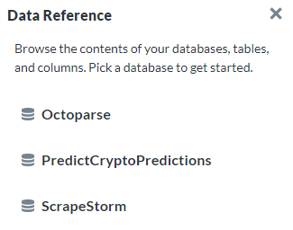

# Documentation Usage

Everything you have visibility to within the Metabase environment is documented. Meaning, every table you see has a description which includes the URL of where the data is collected (as well as the web scraping methodology where informative), and every field within those tables has also been documented on [predictcryptodb.com](https://predictcryptodb.com).

**The best way** to access the documentation just described, is by doing the following:

1. Click on the button in the top right with the console symbol that says `Write SQL` when hovered over:

    
    
2. Click the button on the new window that looks like a book that says `Learn about your data` when hovered over:

    
    
    
3. Now a sidebar should appear from the right side of the page, which I have found to be **by far the best way** to interact with the `Data Reference`:

    
    
    - You can click into any Table, and from there you can click into any field to easily retrieve the definition of the specific field.
    
        

## pkDummy and pkey

The pkDummy and pkey fields are particularly important, so in case you missed it, go back and review [this section](#pulling-most-recent-data) from the usage guide that explains these two fields.

## Using x-rays to explore a table

In the previous sections we have gone over how you would start to understand the fields collected by a table, but we haven't talked too much about exploring the actual values found within a table. For example, we might be able to have a good sense of what the field *Volatility* may mean, but we wouldn't get a good understanding of the range of values for that variable and it's distribution.

A really good way to answer these questions, is by taking an `x-ray` of the table.

- caveat that the database doesn't have the greatest resources that a big company would be able to provide and how this database costs around $220 a month to maintain vs. what a company would spend

(could really use a section on explaining the way pkDummy, pkey work and how they follow two different time zones, show Alteryx trick to deal with the trickiness of UTC not having daylight savings and our local times having it)

## Addtional Notes
- Every table you have visibility to also has an e-mail alert system that alerts me if the data stops flowing through on an hourly (or daily for some) basis. If anything becomes broken I will remove the visibility of that table within Metabase, so if a table is found within the Metabase environment you can assume the web scraper for that table is still functioning correctly and that the data is uploaded to the table on an automated schedule. 

- Any table that starts with the text `AYX` followed by a bunch of random letters and numbers, is a *Temporary Table* that was made through Alteryx. Please ignore these tables completely, as they will disappear over time.
