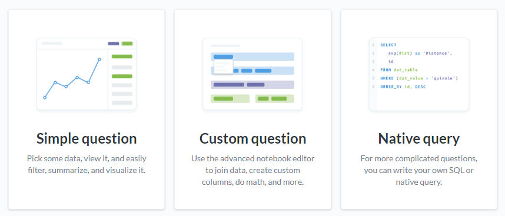
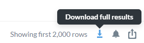
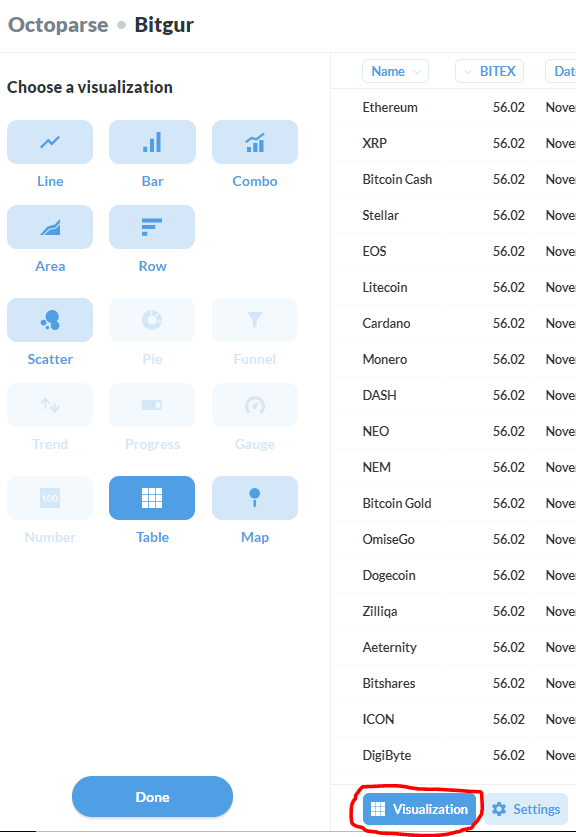
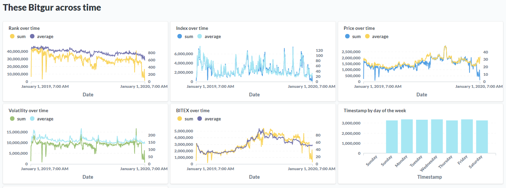

--- 
title: "Predict Crypto Database Quick Start Guide"
author: "Ricky Esclapon - riccardo.esclapon@colorado.edu"
date: "2020-02-23"
site: bookdown::bookdown_site
output: 
  bookdown::gitbook:
    config:
      sharing: null
      search: no
documentclass: book
bibliography: [book.bib, packages.bib]
biblio-style: apalike
link-citations: yes
github-repo: rstudio/bookdown-demo
description: "This is a quick start guide for the Predict Crypto database which should provide the support you need to interact with the database and pull data as you would like."
always_allow_html: yes
---

# Overview

[](https://predictcryptodb.com)

This is a quick start guide for the [Predict Crypto DataBase](https://predictcryptodb.com) which should provide the support you need to interact with the database and pull data. Everything you need to know will be outlined in this document and you can use the sidebar on the left (`s` is the hotkey to show/hide it) to review the following sections:

1. Overview- This section.

2. [Interacting with the DB-](#interacting-with-the-db) Instructions around accessing the ***Metabase*** environment that will allow you to interact with the database, which is hosted on the website [PredictCryptoDB.com](https://predictcryptodb.com)

3. [Useful Tables-](#useful-tables) A review of some of the more useful/interesting tables you can find within the database and an overview of the best places to get started.

4. [Usage Guide-](#usage-guide) This guide explores some of the functionality found within the website/Metabase environment.

5. [Documentation Usage-](#documentation-usage) An overview of the documentation that is available through the Metabase environment and how to use it to answer questions you may have around where the data is sourced from as well as a complete data dictionary for every field in every table.

6. [Additional Tips-](#additional-tips) Some additional notes around using the environment to its full potential. This section goes over things like [pulling the most recent data](#pulling-most-recent-data), [creating dashboards](#creating-dashboards), [embedding anything you create as an iframe within a website or blog post](#embedding-anything-created-on-metabase), [creating e-mail triggers](#creating-e-mail-triggers) and [using a Python package to execute trades](#using-the-shrimpy-python-library).

7. [Development Roadmap-](#development-roadmap) This section provides an overview of what tables I am looking to add into the PredictCrypto database next as well as dates on when the new sources will be added. 

*You can toggle the sidebar on the left side of the screen by pressing the letter `s` on your keyboard.*


<!--chapter:end:index.Rmd-->

# Interacting with the DB

First off, why the heck is there a website? If there's a database why wouldn't you just access it through a SQL editor like SSMS or MySQL? Let's start with the benefits of having this environment readily available to access through a website before jumping into how to start interacting with the database.

## Benefits
- Giving access to the database can be challenging, and having a centralized server that can be accessed through a website allows us to analyze the data without worrying about individual IP addresses being allowed access and other issues we would run into relating to authentication without this type of environment to work out of.

- There is no setup required on your part to start working with the database and as soon as your account is setup you can start writing SQL queries through the website and log into the website at any time. 

- You can access the Metabase interface to interact with the database from any device, like a tablet or smartphone.

- It works as a shared environment where we can all collaborate and see each other's dashboards, sql queries, visualizations etc... This is similar to the way a Tableau Online website would work within an organization.

- Makes creating dashboards to visualize the data extremely simple. Those dashboards can then be shared and be embedded, and the data can be refreshed on a schedule in a matter of clicks.

## "Metabase" explained 

First, let me clarify on what I mean by *Metabase* and how this all works. 

1. [Metabase](https://www.metabase.com/) is the name of the open source software that we are using to interact with the database.

2. Using the [docker container available to download on Metabase's website](https://hub.docker.com/r/metabase/metabase/), I stood up a server-type environment in AWS that hosts the Metabase instance that is connected to the database.

3. The AWS environment running the Metabase instance can be connected to by opening your web browser and navigating to the https secured website [predictcryptodb.com](https://predictcryptodb.com). From here, you will use the set of credentials that you created after clicking on the invitation from the e-mail you received. If you need an invite to create a set of credentials, e-mail me at riccardo.esclapon@colorado.edu.


## Logging In

1. To get started, the first thing you will want to do every time is go to the URL [predictcryptodb.com](https://predictcryptodb.com). You should see a login page:

    
    
    + If you are having issues accessing the website, try spelling the url including `https`  [***https://***predictcryptodb.com](https://predictcryptodb.com). 

    + Before you can login, you need to configure your account through the e-mail you should have received. If you did not receive the e-mail, check your spam folder first:

        
    
        + Configure your password and you will be able to use your e-mail and password to login in the future:
    
        

2. Once you have logged in, you should see a page that looks like this:

    


In the next section we will walk through some useful tables found in the database to get you started


<!--chapter:end:02-InteractWithDB.Rmd-->

# Useful Tables


In this section we will be reviewing some interesting tables and good places to get started.

## Browse Data

Let's start by clicking on the `Browse Data` tab in the top right of the Metabase environment:


Here, you should see the options `Octoparse` and `ScrapeStorm`:


- `Octoparse` is the schema that is associated with data I have collected by using the *Octoparse* web scraping software.

- Conversely, `ScrapeStorm` is the schema associated with data collected using the *ScrapeStorm* web scraping software.

- You should also see an option for `PredictCryptoPredictions`. This schema does not have much in it right now, but over time as I do more predictive modeling it will populate with new tables for new predictive models and is used to simulate model performance before starting to programmatically trade using the predictions. This guide ignores this schema/database for now to focus on the raw data itself, which always comes from the databases `Octoparse` and `ScrapeStorm`.

    <!-- + The web scrapers that are run through Octoparse run on their servers in the cloud, which are very stable but have had some issues here and there in the past. -->

    <!-- + The web scrapers that are run through ScrapeStorm run on a local machine on my end. I have a computer in the cloud that runs 24/7 but even after upgrading the hardware on it ScrapeStorm kept crashing, so this currently runs on my powerful desktop computer that is always on at home. When these run, the data flows in almost immediately, meaning if it's 4:05PM and you pulled the latest hour of data (which would be equivalent to the ***`max(pkDummy)`***, more to come on that later on) -->

**Back in MetaBase, let's click on the option that says `Octoparse`:**


- Now you should see the tables that are contained within the `Octoparse` schema. By hovering over each table, you will see three options appear, which will be better explained in the [next section about *Documentation Usage*](#documentation-usage). In the screenshot the mouse is hovering over the `i` symbol for the Bitgur table:

    

    - By clicking on the middle button that says *Learn more about this table*, you will be brought to its documentation:
    
        

For now, let's go ahead and click on the name of the table `Bitgur`:


After clicking on the table name, you should see some example data show up. This shows the first 2,000 rows of data found in the table:


In the next section [Usage Guide](#usage-guide) we will walk through some of the functionality associated with the things circled in red in the screenshot above using the Bitgur table as an example.


## Useful tables
- For the previews below, keep an eye out for a button to show more columns:


- Things will tend to live as chr/strings within the database because I found that saving everything as a string prevents schema conflicts from no longer uploading data to the database after it gets collected. The previews below will show you the data types as well, so just keep in mind you might have to change the data types sometimes after extracting the data from the database.

- The data shown below should be no more than 1 day old. The latest data is shown for each table and this document refreshes automatically daily.

### Tables in `Octoparse` db
*All date/time fields in the Octoparse database are in [UTC](https://www.google.com/search?q=time+utc)*

#### [**`Bitgur`**](https://predictcryptodb.com/question/6)
<!-- Bitgur is a website that aggregates cryptocurrency prices and offers tools to analyze the cryptocurrency markets by connecting directly to the API of the different exchanges in a very similar way to the way the most famous website in this space [CoinMarketCap](coinmarketcap.com) does. It's important to note however, that CoinMarketCap connects to 306 exchanges and Bitgur connects to only 56 exchanges (as of 01/01/2020); this results in dramatically different values in terms of volume, but the price and market capitalization would track very closely between the two websites. I don't currently scrape data from CoinMarketCap because they prohibit this type of behavior in their website usage terms in order to sell an extremely expensive API. -->

<div data-pagedtable="false">
  <script data-pagedtable-source type="application/json">
{"columns":[{"label":["Index"],"name":[1],"type":["dbl"],"align":["right"]},{"label":["BITEX"],"name":[2],"type":["dbl"],"align":["right"]},{"label":["Rank"],"name":[3],"type":["int"],"align":["right"]},{"label":["Name"],"name":[4],"type":["chr"],"align":["left"]},{"label":["Symbol"],"name":[5],"type":["chr"],"align":["left"]},{"label":["Price"],"name":[6],"type":["dbl"],"align":["right"]},{"label":["Volatility"],"name":[7],"type":["dbl"],"align":["right"]},{"label":["DateTime"],"name":[8],"type":["chr"],"align":["left"]},{"label":["Date"],"name":[9],"type":["chr"],"align":["left"]},{"label":["pkDummy"],"name":[10],"type":["chr"],"align":["left"]},{"label":["pkey"],"name":[11],"type":["chr"],"align":["left"]}],"data":[{"1":"25.84","2":"77.15","3":"1","4":"Bitcoin","5":"BTC","6":"9734.20000","7":"20.32","8":"2020-02-24 05:00:46","9":"2020-02-24","10":"2020-02-24 05","11":"2020-02-24 05BTC"},{"1":"25.84","2":"77.15","3":"2","4":"Ethereum","5":"ETH","6":"267.29000","7":"38.35","8":"2020-02-24 05:00:48","9":"2020-02-24","10":"2020-02-24 05","11":"2020-02-24 05ETH"},{"1":"25.84","2":"77.15","3":"3","4":"XRP","5":"XRP","6":"0.27377","7":"23.63","8":"2020-02-24 05:00:48","9":"2020-02-24","10":"2020-02-24 05","11":"2020-02-24 05XRP"},{"1":"25.84","2":"77.15","3":"4","4":"Bitcoin Cash","5":"BCH","6":"388.38000","7":"45.98","8":"2020-02-24 05:00:48","9":"2020-02-24","10":"2020-02-24 05","11":"2020-02-24 05BCH"},{"1":"25.84","2":"77.15","3":"5","4":"Bitcoin SV","5":"BSV","6":"289.28000","7":"25.23","8":"2020-02-24 05:00:48","9":"2020-02-24","10":"2020-02-24 05","11":"2020-02-24 05BSV"}],"options":{"columns":{"min":{},"max":[10]},"rows":{"min":[10],"max":[10]},"pages":{}}}
  </script>
</div>
<!-- - Source: [www.bitgur.com](https://bitgur.com/) -->

- Data collected since: 2018-11-11

- Documentation: [predictcryptodb.com/reference/databases/2/tables/36](https://predictcryptodb.com/reference/databases/2/tables/36)


#### [**`BitgurPerformance`**](https://predictcryptodb.com/question/7)
<div data-pagedtable="false">
  <script data-pagedtable-source type="application/json">
{"columns":[{"label":["Index"],"name":[1],"type":["dbl"],"align":["right"]},{"label":["BITEX"],"name":[2],"type":["dbl"],"align":["right"]},{"label":["Rank"],"name":[3],"type":["int"],"align":["right"]},{"label":["Name"],"name":[4],"type":["chr"],"align":["left"]},{"label":["Symbol"],"name":[5],"type":["chr"],"align":["left"]},{"label":["Price"],"name":[6],"type":["dbl"],"align":["right"]},{"label":["Performance15min"],"name":[7],"type":["dbl"],"align":["right"]},{"label":["Performance1h"],"name":[8],"type":["dbl"],"align":["right"]},{"label":["Performance3h"],"name":[9],"type":["dbl"],"align":["right"]},{"label":["Performance1d"],"name":[10],"type":["dbl"],"align":["right"]},{"label":["Performance7d"],"name":[11],"type":["dbl"],"align":["right"]},{"label":["Performance1m"],"name":[12],"type":["dbl"],"align":["right"]},{"label":["Performance3m"],"name":[13],"type":["dbl"],"align":["right"]},{"label":["Performance6m"],"name":[14],"type":["dbl"],"align":["right"]},{"label":["Volatility"],"name":[15],"type":["dbl"],"align":["right"]},{"label":["Date"],"name":[16],"type":["chr"],"align":["left"]},{"label":["pkDummy"],"name":[17],"type":["chr"],"align":["left"]},{"label":["DateTime"],"name":[18],"type":["chr"],"align":["left"]},{"label":["pkey"],"name":[19],"type":["chr"],"align":["left"]}],"data":[{"1":"25.84","2":"77.15","3":"1","4":"Bitcoin","5":"BTC","6":"9734.20000","7":"0.06","8":"-0.20","9":"-1.39","10":"-1.12","11":"1.19","12":"15.29","13":"38.46","14":"-4.16","15":"20.32","16":"2020-02-24","17":"2020-02-24 05","18":"2020-02-24 05:00:32","19":"2020-02-24 05BTC"},{"1":"25.84","2":"77.15","3":"1","4":"Bitcoin","5":"BTC","6":"9729.10000","7":"0.01","8":"-0.25","9":"-1.44","10":"-1.17","11":"1.13","12":"15.23","13":"38.39","14":"-4.21","15":"20.32","16":"2020-02-24","17":"2020-02-24 05","18":"2020-02-24 05:00:54","19":"2020-02-24 05BTC"},{"1":"25.84","2":"77.15","3":"2","4":"Ethereum","5":"ETH","6":"267.30000","7":"0.31","8":"-0.26","9":"-1.96","10":"0.50","11":"0.57","12":"63.64","13":"88.05","14":"40.09","15":"38.35","16":"2020-02-24","17":"2020-02-24 05","18":"2020-02-24 05:00:34","19":"2020-02-24 05ETH"},{"1":"25.84","2":"77.15","3":"2","4":"Ethereum","5":"ETH","6":"267.31000","7":"0.32","8":"-0.25","9":"-1.95","10":"0.51","11":"0.58","12":"63.65","13":"88.06","14":"40.10","15":"38.35","16":"2020-02-24","17":"2020-02-24 05","18":"2020-02-24 05:00:55","19":"2020-02-24 05ETH"},{"1":"25.84","2":"77.15","3":"3","4":"XRP","5":"XRP","6":"0.27378","7":"-0.34","8":"-0.10","9":"-2.46","10":"-1.82","11":"-3.93","12":"23.24","13":"21.31","14":"0.71","15":"23.63","16":"2020-02-24","17":"2020-02-24 05","18":"2020-02-24 05:00:34","19":"2020-02-24 05XRP"}],"options":{"columns":{"min":{},"max":[10]},"rows":{"min":[10],"max":[10]},"pages":{}}}
  </script>
</div>
<!-- - Source: [www.bitgur.com/performance](https://bitgur.com/performance) -->
        
- Data collected since: 2019-11-05

- Documentation: [predictcryptodb.com/reference/databases/2/tables/60](https://predictcryptodb.com/reference/databases/2/tables/60)


#### [**`CoinCheckup`**](https://predictcryptodb.com/question/11)
<div data-pagedtable="false">
  <script data-pagedtable-source type="application/json">
{"columns":[{"label":["Rank"],"name":[1],"type":["int"],"align":["right"]},{"label":["Symbol"],"name":[2],"type":["chr"],"align":["left"]},{"label":["Name"],"name":[3],"type":["chr"],"align":["left"]},{"label":["PercChange1h"],"name":[4],"type":["chr"],"align":["left"]},{"label":["PercChange24h"],"name":[5],"type":["chr"],"align":["left"]},{"label":["PercChange7d"],"name":[6],"type":["chr"],"align":["left"]},{"label":["Price"],"name":[7],"type":["dbl"],"align":["right"]},{"label":["MarketCap"],"name":[8],"type":["chr"],"align":["left"]},{"label":["Volume24h"],"name":[9],"type":["dbl"],"align":["right"]},{"label":["PercScore_OpenChannels"],"name":[10],"type":["int"],"align":["right"]},{"label":["PercScore_CoinStrength"],"name":[11],"type":["int"],"align":["right"]},{"label":["PercScore_ProductStrength"],"name":[12],"type":["int"],"align":["right"]},{"label":["PercScore_BrandAwareness"],"name":[13],"type":["int"],"align":["right"]},{"label":["PercScore_GithubActivity"],"name":[14],"type":["int"],"align":["right"]},{"label":["PercScore_SocialMedia"],"name":[15],"type":["int"],"align":["right"]},{"label":["AlgoScoreRank"],"name":[16],"type":["int"],"align":["right"]},{"label":["AlgoScoreOutOf5"],"name":[17],"type":["dbl"],"align":["right"]},{"label":["AgeMonths"],"name":[18],"type":["int"],"align":["right"]},{"label":["PercVolatility7d"],"name":[19],"type":["dbl"],"align":["right"]},{"label":["PercVolatility30d"],"name":[20],"type":["dbl"],"align":["right"]},{"label":["PercReturns2017"],"name":[21],"type":["chr"],"align":["left"]},{"label":["PercReturns2018"],"name":[22],"type":["chr"],"align":["left"]},{"label":["MaxDailyDrawdownPerc"],"name":[23],"type":["chr"],"align":["left"]},{"label":["MaxMonthlyDrawdownPerc"],"name":[24],"type":["chr"],"align":["left"]},{"label":["MaxDailyGrowthPerc"],"name":[25],"type":["chr"],"align":["left"]},{"label":["MaxMonthlyGrowthPerc"],"name":[26],"type":["chr"],"align":["left"]},{"label":["TA_Sells"],"name":[27],"type":["int"],"align":["right"]},{"label":["TA_Neutrals"],"name":[28],"type":["int"],"align":["right"]},{"label":["TA_Buys"],"name":[29],"type":["int"],"align":["right"]},{"label":["TA_Updated"],"name":[30],"type":["chr"],"align":["left"]},{"label":["DateTime"],"name":[31],"type":["chr"],"align":["left"]},{"label":["Date"],"name":[32],"type":["chr"],"align":["left"]},{"label":["pkDummy"],"name":[33],"type":["chr"],"align":["left"]},{"label":["pkey"],"name":[34],"type":["chr"],"align":["left"]}],"data":[{"1":"1","2":"BTC","3":"Bitcoin","4":"-0.0846117","5":"-0.41","6":"-0.58","7":"9771.7600","8":"","9":"19535.70","10":"100","11":"72","12":"90","13":"0","14":"100","15":"5","16":"89","17":"3.7","18":"82","19":"6.60","20":"13.67","21":"NA","22":"-72.86","23":"13.43","24":"16.08","25":"17.44","26":"46.68","27":"1","28":"11","29":"14","30":"Sunday, February 23rd 2020","31":"2020-02-24 05:07:56","32":"2020-02-24","33":"2020-02-24 05","34":"2020-02-24 05BTC"},{"1":"1","2":"BTC","3":"Bitcoin","4":"-0.0504365","5":"-0.54","6":"-0.60","7":"9768.7900","8":"","9":"19535.70","10":"100","11":"72","12":"90","13":"0","14":"100","15":"5","16":"89","17":"3.7","18":"82","19":"6.60","20":"13.67","21":"NA","22":"-72.86","23":"13.43","24":"16.08","25":"17.44","26":"46.68","27":"1","28":"11","29":"14","30":"Sunday, February 23rd 2020","31":"2020-02-24 05:13:36","32":"2020-02-24","33":"2020-02-24 05","34":"2020-02-24 05BTC"},{"1":"2","2":"ETH","3":"Ethereum","4":"-0.117429","5":"0.62","6":"6.29","7":"268.1200","8":"","9":"1389.18","10":"100","11":"90","12":"63","13":"78","14":"78","15":"100","16":"37","17":"3.9","18":"55","19":"11.04","20":"22.86","21":"NA","22":"-82.16","23":"42.00","24":"15.47","25":"28.85","26":"15.11","27":"0","28":"9","29":"17","30":"Sunday, February 23rd 2020","31":"2020-02-24 05:09:01","32":"2020-02-24","33":"2020-02-24 05","34":"2020-02-24 05ETH"},{"1":"2","2":"ETH","3":"Ethereum","4":"0.0117168","5":"0.43","6":"6.29","7":"268.0000","8":"","9":"1389.18","10":"100","11":"90","12":"63","13":"78","14":"78","15":"100","16":"37","17":"3.9","18":"55","19":"11.04","20":"22.86","21":"NA","22":"-82.16","23":"42.00","24":"15.47","25":"28.85","26":"15.11","27":"0","28":"9","29":"17","30":"Sunday, February 23rd 2020","31":"2020-02-24 05:13:55","32":"2020-02-24","33":"2020-02-24 05","34":"2020-02-24 05ETH"},{"1":"3","2":"XRP","3":"XRP","4":"-0.0684554","5":"-1.47","6":"-3.36","7":"0.2751","8":"12033467494","9":"2390229187.00","10":"NA","11":"NA","12":"NA","13":"NA","14":"NA","15":"NA","16":"2013","17":"3.7","18":"79","19":"11.01","20":"22.80","21":"NA","22":"-84.17","23":"42.00","24":"13.49","25":"20.84","26":"24.61","27":"4","28":"10","29":"12","30":"Sunday, February 23rd 2020","31":"2020-02-24 05:10:03","32":"2020-02-24","33":"2020-02-24 05","34":"2020-02-24 05XRP"}],"options":{"columns":{"min":{},"max":[10]},"rows":{"min":[10],"max":[10]},"pages":{}}}
  </script>
</div>
<!-- - Source: [www.coincheckup.com](https://coincheckup.com) -->

- Data collected since: 2018-12-04

- Documentation: [predictcryptodb.com/reference/databases/2/tables/587](https://predictcryptodb.com/reference/databases/2/tables/587)


#### [**`CoinCheckupDetails`**](https://predictcryptodb.com/question/12)
<div data-pagedtable="false">
  <script data-pagedtable-source type="application/json">
{"columns":[{"label":["Name"],"name":[1],"type":["chr"],"align":["left"]},{"label":["Symbol"],"name":[2],"type":["chr"],"align":["left"]},{"label":["CirculatingSupply"],"name":[3],"type":["chr"],"align":["left"]},{"label":["MaxSupply"],"name":[4],"type":["chr"],"align":["left"]},{"label":["FirstPriceUSD"],"name":[5],"type":["chr"],"align":["left"]},{"label":["ICO"],"name":[6],"type":["chr"],"align":["left"]},{"label":["EmissionRate"],"name":[7],"type":["chr"],"align":["left"]},{"label":["Blockchain"],"name":[8],"type":["chr"],"align":["left"]},{"label":["Consensus"],"name":[9],"type":["chr"],"align":["left"]},{"label":["Algorithm"],"name":[10],"type":["chr"],"align":["left"]},{"label":["MinutesPerBlock"],"name":[11],"type":["chr"],"align":["left"]},{"label":["TransactionsPerSecond"],"name":[12],"type":["chr"],"align":["left"]},{"label":["Mineable"],"name":[13],"type":["chr"],"align":["left"]},{"label":["Type"],"name":[14],"type":["chr"],"align":["left"]},{"label":["OpenSource"],"name":[15],"type":["chr"],"align":["left"]},{"label":["Github"],"name":[16],"type":["chr"],"align":["left"]},{"label":["CommunityTotalSize"],"name":[17],"type":["chr"],"align":["left"]},{"label":["Status"],"name":[18],"type":["chr"],"align":["left"]},{"label":["Roadmap"],"name":[19],"type":["chr"],"align":["left"]},{"label":["Whitepaper"],"name":[20],"type":["chr"],"align":["left"]},{"label":["FAQ"],"name":[21],"type":["chr"],"align":["left"]},{"label":["BlockExplorer"],"name":[22],"type":["chr"],"align":["left"]},{"label":["Team"],"name":[23],"type":["chr"],"align":["left"]},{"label":["TeamBio"],"name":[24],"type":["chr"],"align":["left"]},{"label":["TeamSocialMedia"],"name":[25],"type":["chr"],"align":["left"]},{"label":["CEO"],"name":[26],"type":["chr"],"align":["left"]},{"label":["CEO_Age"],"name":[27],"type":["chr"],"align":["left"]},{"label":["CEO_LinkedInMentionsCompany"],"name":[28],"type":["chr"],"align":["left"]},{"label":["CEO_PreviousCompaniesAchievements"],"name":[29],"type":["chr"],"align":["left"]},{"label":["CEO_BusinessExperience"],"name":[30],"type":["chr"],"align":["left"]},{"label":["CEO_YearsExperienceCEO"],"name":[31],"type":["chr"],"align":["left"]},{"label":["CEO_ManagedCompanyMillionUSD"],"name":[32],"type":["chr"],"align":["left"]},{"label":["CTO"],"name":[33],"type":["chr"],"align":["left"]},{"label":["CTO_DeveloperYearsExperience"],"name":[34],"type":["chr"],"align":["left"]},{"label":["CTO_YearsExperienceCTO"],"name":[35],"type":["chr"],"align":["left"]},{"label":["NumberOfDevelopers"],"name":[36],"type":["chr"],"align":["left"]},{"label":["NumberOfMarketingSpecialists"],"name":[37],"type":["chr"],"align":["left"]},{"label":["QualityAssuranceSpecialist"],"name":[38],"type":["chr"],"align":["left"]},{"label":["TeamSize"],"name":[39],"type":["chr"],"align":["left"]},{"label":["TeamAverageAge"],"name":[40],"type":["chr"],"align":["left"]},{"label":["AdvisorsBio"],"name":[41],"type":["chr"],"align":["left"]},{"label":["AdvisorsSocialMedia"],"name":[42],"type":["chr"],"align":["left"]},{"label":["Website"],"name":[43],"type":["chr"],"align":["left"]},{"label":["Website2"],"name":[44],"type":["chr"],"align":["left"]},{"label":["Email"],"name":[45],"type":["chr"],"align":["left"]},{"label":["ContactForm"],"name":[46],"type":["chr"],"align":["left"]},{"label":["PhoneNumber"],"name":[47],"type":["chr"],"align":["left"]},{"label":["OfficiallyIncorporated"],"name":[48],"type":["chr"],"align":["left"]},{"label":["Location"],"name":[49],"type":["chr"],"align":["left"]},{"label":["Address"],"name":[50],"type":["chr"],"align":["left"]},{"label":["Blog"],"name":[51],"type":["chr"],"align":["left"]},{"label":["BlogUpdates"],"name":[52],"type":["chr"],"align":["left"]},{"label":["Facebook"],"name":[53],"type":["chr"],"align":["left"]},{"label":["FacebookActive"],"name":[54],"type":["chr"],"align":["left"]},{"label":["Twitter"],"name":[55],"type":["chr"],"align":["left"]},{"label":["TwitterActive"],"name":[56],"type":["chr"],"align":["left"]},{"label":["Youtube"],"name":[57],"type":["chr"],"align":["left"]},{"label":["YoutubeActive"],"name":[58],"type":["chr"],"align":["left"]},{"label":["Slack"],"name":[59],"type":["chr"],"align":["left"]},{"label":["Telegram"],"name":[60],"type":["chr"],"align":["left"]},{"label":["MessageBoard"],"name":[61],"type":["chr"],"align":["left"]},{"label":["TrafficInfoWebsite1"],"name":[62],"type":["chr"],"align":["left"]},{"label":["TrafficInfoWebsite2"],"name":[63],"type":["chr"],"align":["left"]},{"label":["ICO_Price"],"name":[64],"type":["chr"],"align":["left"]},{"label":["ICO_SalePeriod"],"name":[65],"type":["chr"],"align":["left"]},{"label":["ICO_DistributionDate"],"name":[66],"type":["chr"],"align":["left"]},{"label":["ICO_StartTradingDate"],"name":[67],"type":["chr"],"align":["left"]},{"label":["ICO_MinimumInvestment"],"name":[68],"type":["chr"],"align":["left"]},{"label":["ICO_MaximumInvestment"],"name":[69],"type":["chr"],"align":["left"]},{"label":["ICO_AcceptedCurrencies"],"name":[70],"type":["chr"],"align":["left"]},{"label":["ICO_Bonus"],"name":[71],"type":["chr"],"align":["left"]},{"label":["ICOProceedings_Founders"],"name":[72],"type":["chr"],"align":["left"]},{"label":["ICOProceedings_Marketing"],"name":[73],"type":["chr"],"align":["left"]},{"label":["ICOProceedings_Development"],"name":[74],"type":["chr"],"align":["left"]},{"label":["ICOProceedings_Administration"],"name":[75],"type":["chr"],"align":["left"]},{"label":["ICOProceedings_Other"],"name":[76],"type":["chr"],"align":["left"]},{"label":["ResearchDate"],"name":[77],"type":["chr"],"align":["left"]},{"label":["DateTime"],"name":[78],"type":["chr"],"align":["left"]},{"label":["Date"],"name":[79],"type":["chr"],"align":["left"]},{"label":["pkDummy"],"name":[80],"type":["chr"],"align":["left"]}],"data":[{"1":"On.Live","2":"ONL","3":"21,622,303","4":"111,000,000","5":"$0.09","6":"59,725,382","7":"No new tokens created","8":"Ethereum","9":"Ethereum consensus (currently proof of work, will be proof of stake later on)","10":"N/A","11":"N/A","12":"0","13":"No","14":"N/A","15":"yes","16":"https://github.com/OnLivePlatform","17":"2,655","18":"Prototype / MVP","19":"https://on.live/#roadsection","20":"https://on.live/documents/OnLive_Whitepaper.pdf","21":"","22":"https://etherscan.io/token/0x6863be0e7cf7ce860a574760e9020d519a8bdc47","23":"https://on.live/#ourteam","24":"Yes","25":"Yes","26":"Daniel Bayer","27":"N/A","28":"Yes","29":"A pharmacoeconomics, marketing and law graduate with a MA in Civil Law with a wide experience in the field of business development in the private sector, with a wide range of business contacts across Poland and other markets in CEE.","30":"11","31":"5","32":"yes","33":"Kuba Stefa?ski","34":"9","35":"0","36":"4","37":"1","38":"no","39":"12","40":"35","41":"Yes","42":"Yes","43":"https://on.live/","44":"","45":"chris@onlive.ltd","46":"N/A","47":"N/A","48":"Yes","49":"United Kingdom, B60 3DJ QW","50":"7 The Courtyard, Buntsford Drive, Bromsgrove, West Midlands","51":"","52":"no","53":"","54":"yes","55":"","56":"no","57":"","58":"","59":"","60":"","61":"","62":"","63":"","64":"https://medium.com/@On.Live","65":"(latest post was a year ago)","66":"https://www.facebook.com/OnLive.TV","67":"","68":"http://twitter.com/on_live","69":"(latest post was 7 months ago)","70":"N/A","71":"","72":"https://t.me/onlive","73":"n/a","74":"n/a","75":"n/a","76":"n/a","77":"2018-08-07","78":"2020-02-23 11:00:28","79":"2020-02-23","80":"2020-02-23 11"},{"1":"Litex","2":"LXT","3":"999,999,987","4":"2,000,000,000","5":"$0.01","6":"700,000,000","7":"No new tokens created","8":"Ethereum","9":"Ethereum consensus (currently proof of work, will be proof of stake later on)","10":"N/A","11":"N/A","12":"0","13":"No","14":"N/A","15":"no","16":"","17":"594","18":"Prototype / MVP","19":"http://litex.io/#facts","20":"http://litex.io/wp_en.pdf","21":"","22":"https://etherscan.io/token/0xbc46d9961a3932f7d6b64abfdec80c1816c4b835","23":"http://litex.io/#team","24":"Yes","25":"No","26":"Guanghong Xu","27":"N/A","28":"No","29":"A PKU alumni who has 22 years of experience in a wide range of technology and business areas with a focus on providing strategic advisory services in risk management, information security, privacy and data protection, public key infrastructure (PKI) encryption and payment card process review in healthcare and financial industries across the globe.","30":"21","31":"1","32":"yes","33":"N/A","34":"N/A","35":"0","36":"0","37":"0","38":"no","39":"5","40":"35","41":"Yes","42":"No","43":"http://litex.io/","44":"","45":"contact@litex.io","46":"N/A","47":"N/A","48":"No","49":"N/A","50":"N/A","51":"","52":"no","53":"","54":"yes","55":"","56":"yes","57":"","58":"","59":"","60":"","61":"","62":"","63":"","64":"https://medium.com/@litex","65":"(latest post was 9 months ago)","66":"http://facebook.com/litex.io","67":"","68":"https://twitter.com/litex_io","69":"(latest post was 2 months ago)","70":"N/A","71":"","72":"https://t.me/litex_official","73":"n/a","74":"n/a","75":"n/a","76":"n/a","77":"2018-08-29","78":"2020-02-23 11:00:46","79":"2020-02-23","80":"2020-02-23 11"},{"1":"Matchpool","2":"GUP","3":"75,000,000","4":"98,855,150","5":"$0.24","6":"N/A","7":"No new tokens created","8":"Ethereum","9":"Ethereum consensus (currently proof of work, will be proof of stake later on)","10":"N/A","11":"N/A","12":"0","13":"No","14":"Token","15":"no","16":"https://github.com/Matchpool/","17":"26,744","18":"Fully working product","19":"https://www.matchpool.com/roadmap/","20":"https://matchpool.co/wp-content/uploads/2017/04/mp_wp3.pdf","21":"https://medium.com/matchpool/faq/home","22":"https://etherscan.io/token/Guppy","23":"https://www.matchpool.com/team/","24":"Yes","25":"Yes","26":"Yonatan Ben Shimon","27":"N/A","28":"Yes","29":"CEO & Co-Founder - Matchpool\\r\\nFounder - fintech Community organizer\\r\\nCEO - decentralized partners","30":"5.5","31":"5","32":"yes","33":"Or Demri","34":"10","35":"1","36":"4","37":"1","38":"no","39":"14","40":"35","41":"Yes","42":"Yes","43":"https://matchpool.co/","44":"","45":"hello@matchpool.com","46":"N/A","47":"N/A","48":"No","49":"Switzerland","50":"Zug, Switzerland","51":"","52":"no","53":"","54":"yes","55":"","56":"no","57":"","58":"","59":"","60":"","61":"","62":"","63":"","64":"https://blog.matchpool.com/","65":"(latest post was 2 years ago)","66":"https://facebook.com/matchpoolhq","67":"","68":"https://twitter.com/matchpool","69":"(latest post was 3 months ago)","70":"https://www.youtube.com/channel/UCcf_IzeuDxTl9X4f72Y3XYw","71":"","72":"https://t.me/matchpool","73":"No","74":"http://community.matchpool.com/","75":"n/a","76":"n/a","77":"2018-09-24","78":"2020-02-23 11:05:01","79":"2020-02-23","80":"2020-02-23 11"},{"1":"Bitcoin","2":"BTC","3":"18,232,800","4":"21,000,000","5":"$135.30","6":"N/A","7":"No new tokens created","8":"Blockchain","9":"Proof of work","10":"SHA-256","11":"10","12":"7","13":"Yes","14":"Coin","15":"yes","16":"https://github.com/bitcoin/","17":"0","18":"Fully working product","19":"N/A","20":"https://bitcoin.org/bitcoin.pdf","21":"https://bitcoin.org/en/faq","22":"https://blockchain.info/","23":"https://bitcoin.org/en/about-us","24":"No","25":"No","26":"N/A","27":"N/A","28":"N/A","29":"N/A","30":"N/A","31":"0","32":"no","33":"N/A","34":"N/A","35":"0","36":"0","37":"0","38":"no","39":"0","40":"0","41":"No","42":"No","43":"https://bitcoin.org/en/","44":"https://bitcoinfoundation.org/","45":"privacy@bitcoin.org","46":"N/A","47":"N/A","48":"No","49":"N/A","50":"N/A","51":"https://bitcoin.org/en/blog","52":"no (latest post was 5 months ago)","53":"https://www.facebook.com/bitcoins/","54":"no","55":"N/A","56":"no","57":"N/A","58":"yes","59":"https://bitcoincoreslack.herokuapp.com/","60":"https://telegram.me/bitcoincharts","61":"https://bitcointalk.org/","62":"","63":"","64":"","65":"","66":"","67":"","68":"","69":"","70":"","71":"","72":"","73":"","74":"","75":"","76":"","77":"2018-09-12","78":"2020-02-23 10:00:41","79":"2020-02-23","80":"2020-02-23 10"},{"1":"Primalbase Token","2":"PBT","3":"1,250","4":"1,250","5":"$5,344.50","6":"1,000","7":"No new tokens created","8":"Waves","9":"Waves Consensus","10":"N/A","11":"N/A","12":"0","13":"No","14":"Token","15":"no","16":"","17":"3,063","18":"Fully working product","19":"https://medium.com/@dmitry.faller/q-a-3-primalbase-ico-376300ffbaa0","20":"https://primalbase.com/assets/PrimalbaseWP.pdf","21":"https://medium.com/@dmitry.faller/q-a-1-primalbase-ico-83dbaa0f88e5","22":"http://www.wavesgo.com/assets.html?EdDvbhk4wJ1kL6pMCq1V36GbQE2nGE7Metb87zbaY2JL","23":"https://primalbase.com/project","24":"No","25":"Yes","26":"Ralph Manheim","27":"N/A","28":"Yes","29":"Just CEO at Just Sports Marketing; Commercial Director at Flogs; New Business Development - Football at IMG Media","30":"14","31":"7","32":"no","33":"N/A","34":"N/A","35":"0","36":"1","37":"2","38":"no","39":"9","40":"35","41":"No","42":"Yes","43":"https://primalbase.com/","44":"","45":"primal@primalbase.com","46":"N/A","47":"N/A","48":"Can't trace back","49":"N/A","50":"N/A","51":"","52":"no","53":"","54":"yes","55":"","56":"no","57":"","58":"","59":"","60":"","61":"","62":"","63":"","64":"https://medium.com/primalbase","65":"(latest post was 4 months ago)","66":"https://www.facebook.com/primalbasehq","67":"","68":"https://twitter.com/primalbasehq","69":"(latest post was 4 months ago)","70":"https://www.youtube.com/channel/UCuWyGTEoCOSZrw8KWMKeucQ","71":"","72":"https://t.me/joinchat/AAAAAELBNMavaVUQvMRffQ","73":"n/a","74":"n/a","75":"n/a","76":"n/a","77":"2018-10-29","78":"2020-02-23 10:00:50","79":"2020-02-23","80":"2020-02-23 10"}],"options":{"columns":{"min":{},"max":[10]},"rows":{"min":[10],"max":[10]},"pages":{}}}
  </script>
</div>
<!-- - Source: [www.coincheckup.com](https://coincheckup.com/coins/bitcoin/analysis) -->

- Data collected since: 2019-10-01

- Documentation: [predictcryptodb.com/reference/databases/2/tables/591](https://predictcryptodb.com/reference/databases/2/tables/591)


#### [**`CoinStatsPrices`**](https://predictcryptodb.com/question/13)
<div data-pagedtable="false">
  <script data-pagedtable-source type="application/json">
{"columns":[{"label":["BTC_Dominance"],"name":[1],"type":["dbl"],"align":["right"]},{"label":["Name"],"name":[2],"type":["chr"],"align":["left"]},{"label":["Symbol"],"name":[3],"type":["chr"],"align":["left"]},{"label":["Rank"],"name":[4],"type":["int"],"align":["right"]},{"label":["Price"],"name":[5],"type":["dbl"],"align":["right"]},{"label":["ChangePerc24h"],"name":[6],"type":["dbl"],"align":["right"]},{"label":["BTC_Price"],"name":[7],"type":["dbl"],"align":["right"]},{"label":["DateTime"],"name":[8],"type":["chr"],"align":["left"]},{"label":["Date"],"name":[9],"type":["chr"],"align":["left"]},{"label":["pkDummy"],"name":[10],"type":["chr"],"align":["left"]},{"label":["pkey"],"name":[11],"type":["chr"],"align":["left"]}],"data":[{"1":"66.11","2":"SpectrumNetwork","3":"SPEC","4":"1950","5":"0.000001","6":"0.00","7":"0.00000000","8":"2020-01-30 13:00:01","9":"2020-01-30","10":"2020-01-30 13","11":"2020-01-30 13SPEC"},{"1":"66.11","2":"C2C System","3":"C2C","4":"1951","5":"0.000002","6":"0.00","7":"0.00000000","8":"2020-01-30 13:00:02","9":"2020-01-30","10":"2020-01-30 13","11":"2020-01-30 13C2C"},{"1":"66.11","2":"Ripto Bux","3":"RBX","4":"1952","5":"0.000001","6":"0.00","7":"0.00000000","8":"2020-01-30 13:00:04","9":"2020-01-30","10":"2020-01-30 13","11":"2020-01-30 13RBX"},{"1":"66.11","2":"KAASO","3":"KAASO","4":"1954","5":"0.000037","6":"-4.66","7":"0.00000000","8":"2020-01-30 13:00:07","9":"2020-01-30","10":"2020-01-30 13","11":"2020-01-30 13KAASO"},{"1":"66.11","2":"CryptoTradingCoin","3":"CTD","4":"1955","5":"0.001384","6":"0.00","7":"0.00000015","8":"2020-01-30 13:00:08","9":"2020-01-30","10":"2020-01-30 13","11":"2020-01-30 13CTD"}],"options":{"columns":{"min":{},"max":[10]},"rows":{"min":[10],"max":[10]},"pages":{}}}
  </script>
</div>
<!-- - Source: [www.coinstats.app](https://coinstats.app/) -->

- Data collected since: 2018-11-11

- Documentation: [predictcryptodb.com/reference/databases/2/tables/28](https://predictcryptodb.com/reference/databases/2/tables/28)


#### [**`CoinToBuy`**](https://predictcryptodb.com/question/14)
<div data-pagedtable="false">
  <script data-pagedtable-source type="application/json">
{"columns":[{"label":["SafetyRank"],"name":[1],"type":["int"],"align":["right"]},{"label":["Name"],"name":[2],"type":["chr"],"align":["left"]},{"label":["Price"],"name":[3],"type":["dbl"],"align":["right"]},{"label":["SafetyScore"],"name":[4],"type":["dbl"],"align":["right"]},{"label":["PotentialProfitPercent"],"name":[5],"type":["dbl"],"align":["right"]},{"label":["PotentialPrice"],"name":[6],"type":["dbl"],"align":["right"]},{"label":["DateTime"],"name":[7],"type":["chr"],"align":["left"]},{"label":["Date"],"name":[8],"type":["chr"],"align":["left"]},{"label":["pkDummy"],"name":[9],"type":["chr"],"align":["left"]}],"data":[{"1":"1","2":"Ethereum","3":"225.720000","4":"6.7","5":"0.4","6":"226.510000","7":"2020-02-08 14:00:21","8":"2020-02-08","9":"2020-02-08 14"},{"1":"2","2":"TRON","3":"0.021923","4":"6.5","5":"4.4","6":"0.022893","7":"2020-02-08 14:00:21","8":"2020-02-08","9":"2020-02-08 14"},{"1":"3","2":"Bitcoin","3":"9799.130000","4":"6.5","5":"17.2","6":"11487.900000","7":"2020-02-08 14:00:21","8":"2020-02-08","9":"2020-02-08 14"},{"1":"4","2":"Dash","3":"126.330000","4":"6.5","5":"8.0","6":"136.480000","7":"2020-02-08 14:00:21","8":"2020-02-08","9":"2020-02-08 14"},{"1":"5","2":"Litecoin","3":"75.880000","4":"6.4","5":"23.1","6":"93.450000","7":"2020-02-08 14:00:21","8":"2020-02-08","9":"2020-02-08 14"}],"options":{"columns":{"min":{},"max":[10]},"rows":{"min":[10],"max":[10]},"pages":{}}}
  </script>
</div>
<!-- - Source: [www.cointobuy.io](www.cointobuy.io) -->

- Data collected since: 2018-11-16

- Documentation: [predictcryptodb.com/reference/databases/2/tables/26](https://predictcryptodb.com/reference/databases/2/tables/26)


#### [**`TechnicalAnalysis`**](https://predictcryptodb.com/question/10)
<div data-pagedtable="false">
  <script data-pagedtable-source type="application/json">
{"columns":[{"label":["Name"],"name":[1],"type":["chr"],"align":["left"]},{"label":["Symbol"],"name":[2],"type":["chr"],"align":["left"]},{"label":["MA_5h"],"name":[3],"type":["chr"],"align":["left"]},{"label":["TA_5h"],"name":[4],"type":["chr"],"align":["left"]},{"label":["Summary_5h"],"name":[5],"type":["chr"],"align":["left"]},{"label":["TA_Sells_5h"],"name":[6],"type":["int"],"align":["right"]},{"label":["TA_Buys_5h"],"name":[7],"type":["int"],"align":["right"]},{"label":["TA_Neutrals_5h"],"name":[8],"type":["int"],"align":["right"]},{"label":["MA_Buys_5h"],"name":[9],"type":["int"],"align":["right"]},{"label":["MA_Sells_5h"],"name":[10],"type":["int"],"align":["right"]},{"label":["RSI14d_5h"],"name":[11],"type":["dbl"],"align":["right"]},{"label":["STOCHRSI14d_5h"],"name":[12],"type":["dbl"],"align":["right"]},{"label":["MACD_5h"],"name":[13],"type":["dbl"],"align":["right"]},{"label":["Williams_5h"],"name":[14],"type":["dbl"],"align":["right"]},{"label":["CCI_5h"],"name":[15],"type":["dbl"],"align":["right"]},{"label":["ATR_5h"],"name":[16],"type":["dbl"],"align":["right"]},{"label":["HighsLows_5h"],"name":[17],"type":["dbl"],"align":["right"]},{"label":["UltimateOscillator_5h"],"name":[18],"type":["dbl"],"align":["right"]},{"label":["ROC_5h"],"name":[19],"type":["dbl"],"align":["right"]},{"label":["BullBearPower_5h"],"name":[20],"type":["dbl"],"align":["right"]},{"label":["Summary_Day"],"name":[21],"type":["chr"],"align":["left"]},{"label":["MA_Day"],"name":[22],"type":["chr"],"align":["left"]},{"label":["TA_Day"],"name":[23],"type":["chr"],"align":["left"]},{"label":["TA_Buys_Day"],"name":[24],"type":["int"],"align":["right"]},{"label":["TA_Sells_Day"],"name":[25],"type":["int"],"align":["right"]},{"label":["TA_Neutrals_Day"],"name":[26],"type":["int"],"align":["right"]},{"label":["MA_Buys_Day"],"name":[27],"type":["int"],"align":["right"]},{"label":["MA_Sells_Day"],"name":[28],"type":["int"],"align":["right"]},{"label":["RSI14d_Day"],"name":[29],"type":["dbl"],"align":["right"]},{"label":["StochRSI14d_Day"],"name":[30],"type":["dbl"],"align":["right"]},{"label":["MACD_Day"],"name":[31],"type":["dbl"],"align":["right"]},{"label":["Williams_Day"],"name":[32],"type":["dbl"],"align":["right"]},{"label":["CCI_Day"],"name":[33],"type":["dbl"],"align":["right"]},{"label":["ATR_Day"],"name":[34],"type":["dbl"],"align":["right"]},{"label":["HighsLows_Day"],"name":[35],"type":["dbl"],"align":["right"]},{"label":["UltimateOscillator_Day"],"name":[36],"type":["dbl"],"align":["right"]},{"label":["ROC_Day"],"name":[37],"type":["dbl"],"align":["right"]},{"label":["BullBearPower_Day"],"name":[38],"type":["dbl"],"align":["right"]},{"label":["DateTime"],"name":[39],"type":["chr"],"align":["left"]},{"label":["Date"],"name":[40],"type":["chr"],"align":["left"]},{"label":["pkDummy"],"name":[41],"type":["chr"],"align":["left"]},{"label":["pkey"],"name":[42],"type":["chr"],"align":["left"]}],"data":[{"1":"NA","2":"BLZ","3":"Strong Sell","4":"Strong Sell","5":"Strong Sell","6":"7","7":"1","8":"1","9":"0","10":"12","11":"31.809","12":"4.739","13":"0.000","14":"-86.840","15":"-132.6206","16":"0.0000","17":"0.0000","18":"45.127","19":"-11.599","20":"0.0001","21":"Strong Sell","22":"Strong Sell","23":"Strong Sell","24":"1","25":"7","26":"0","27":"0","28":"12","29":"39.747","30":"4.053","31":"0.000","32":"-98.757","33":"-85.6759","34":"0.0000","35":"0.0000","36":"31.776","37":"-68.441","38":"0.0001","39":"2020-02-23 23:01:18","40":"2020-02-23","41":"2020-02-23 23","42":"2020-02-23 23BLZ"},{"1":"NA","2":"KUSH","3":"Buy","4":"Sell","5":"Neutral","6":"4","7":"3","8":"2","9":"7","10":"5","11":"52.683","12":"8.788","13":"0.001","14":"-78.556","15":"-49.7069","16":"0.0012","17":"0.0000","18":"40.073","19":"13.234","20":"-0.0011","21":"Neutral","22":"Neutral","23":"BUY","24":"5","25":"3","26":"2","27":"6","28":"6","29":"49.981","30":"76.812","31":"-0.001","32":"-50.266","33":"106.6608","34":"0.0013","35":"0.0019","36":"47.920","37":"202.398","38":"0.0029","39":"2020-02-23 23:01:39","40":"2020-02-23","41":"2020-02-23 23","42":"2020-02-23 23KUSH"},{"1":"NA","2":"ETG","3":"Sell","4":"Strong Sell","5":"Strong Sell","6":"10","7":"1","8":"0","9":"1","10":"11","11":"25.558","12":"41.271","13":"0.000","14":"-73.231","15":"-105.2199","16":"0.0002","17":"-0.0001","18":"59.541","19":"-64.056","20":"-0.0012","21":"Strong Sell","22":"Strong Sell","23":"Strong Sell","24":"0","25":"9","26":"0","27":"0","28":"12","29":"34.324","30":"3.037","31":"-0.001","32":"-94.743","33":"-185.6302","34":"0.0009","35":"-0.0015","36":"40.352","37":"-91.885","38":"-0.0033","39":"2020-02-23 23:02:01","40":"2020-02-23","41":"2020-02-23 23","42":"2020-02-23 23ETG"},{"1":"NA","2":"ITI","3":"Buy","4":"Strong Buy","5":"Strong Buy","6":"0","7":"8","8":"0","9":"10","10":"2","11":"70.588","12":"91.994","13":"0.223","14":"-2.021","15":"102.0260","16":"0.1287","17":"0.2428","18":"65.703","19":"24.916","20":"0.3525","21":"Neutral","22":"Sell","23":"BUY","24":"5","25":"2","26":"3","27":"5","28":"7","29":"42.729","30":"100.000","31":"-0.882","32":"-36.718","33":"127.4638","34":"0.3949","35":"0.8289","36":"49.971","37":"159.274","38":"0.2025","39":"2020-02-23 23:02:23","40":"2020-02-23","41":"2020-02-23 23","42":"2020-02-23 23ITI"},{"1":"NA","2":"LOT","3":"Buy","4":"Sell","5":"Neutral","6":"5","7":"0","8":"3","9":"10","10":"2","11":"48.349","12":"8.024","13":"0.000","14":"-86.905","15":"-88.0009","16":"0.0000","17":"0.0000","18":"48.814","19":"-18.011","20":"0.0000","21":"Neutral","22":"Sell","23":"Strong Buy","24":"6","25":"0","26":"5","27":"5","28":"7","29":"50.983","30":"57.693","31":"0.000","32":"-53.039","33":"71.5655","34":"0.0000","35":"0.0000","36":"51.211","37":"10.909","38":"0.0000","39":"2020-02-23 23:02:46","40":"2020-02-23","41":"2020-02-23 23","42":"2020-02-23 23LOT"}],"options":{"columns":{"min":{},"max":[10]},"rows":{"min":[10],"max":[10]},"pages":{}}}
  </script>
</div>
<!-- - Source: [www.investing.com/crypto/](https://www.investing.com/crypto/) -->

- Data collected since: 2018-11-15

- Documentation: [predictcryptodb.com/reference/databases/2/tables/61](https://predictcryptodb.com/reference/databases/2/tables/61)


### Tables in `ScrapeStorm` db
*Any date/time fields in the ScrapeStorm database are in the MST timezone (Colorado time)*

#### [**`Messari`**](https://predictcryptodb.com/question/15)
<div data-pagedtable="false">
  <script data-pagedtable-source type="application/json">
{"columns":[{"label":["Name"],"name":[1],"type":["chr"],"align":["left"]},{"label":["Rank"],"name":[2],"type":["chr"],"align":["left"]},{"label":["PriceUSD"],"name":[3],"type":["chr"],"align":["left"]},{"label":["PriceBTC"],"name":[4],"type":["chr"],"align":["left"]},{"label":["PercChange24hVsUSD"],"name":[5],"type":["chr"],"align":["left"]},{"label":["PercChange24hVsBTC"],"name":[6],"type":["chr"],"align":["left"]},{"label":["Liquid_MarketCap"],"name":[7],"type":["chr"],"align":["left"]},{"label":["YPlus10_MarketCap"],"name":[8],"type":["chr"],"align":["left"]},{"label":["Y2050_MarketCap"],"name":[9],"type":["chr"],"align":["left"]},{"label":["Reported_MarketCap"],"name":[10],"type":["chr"],"align":["left"]},{"label":["Real24hVolume"],"name":[11],"type":["chr"],"align":["left"]},{"label":["Reported24hVolume"],"name":[12],"type":["chr"],"align":["left"]},{"label":["VolumeOverstatementMultiple"],"name":[13],"type":["chr"],"align":["left"]},{"label":["VolumeTurnover24h"],"name":[14],"type":["chr"],"align":["left"]},{"label":["Y2050_Supply"],"name":[15],"type":["chr"],"align":["left"]},{"label":["Reported_Supply"],"name":[16],"type":["chr"],"align":["left"]},{"label":["Liquid_Supply"],"name":[17],"type":["chr"],"align":["left"]},{"label":["PercSupplyIssuedY2050"],"name":[18],"type":["chr"],"align":["left"]},{"label":["CurrentInflation"],"name":[19],"type":["chr"],"align":["left"]},{"label":["YPlus10_Supply"],"name":[20],"type":["chr"],"align":["left"]},{"label":["YPlus10_PercSupplyIssued"],"name":[21],"type":["chr"],"align":["left"]},{"label":["ATH_USD"],"name":[22],"type":["chr"],"align":["left"]},{"label":["TimeFromATH"],"name":[23],"type":["chr"],"align":["left"]},{"label":["PercDownFromATH"],"name":[24],"type":["chr"],"align":["left"]},{"label":["BreakevenMultiple"],"name":[25],"type":["chr"],"align":["left"]},{"label":["CycleLowUSD"],"name":[26],"type":["chr"],"align":["left"]},{"label":["TimeSinceLow"],"name":[27],"type":["chr"],"align":["left"]},{"label":["PercUpSinceLow"],"name":[28],"type":["chr"],"align":["left"]},{"label":["TokenSaleProceedsUSD"],"name":[29],"type":["chr"],"align":["left"]},{"label":["ChangeSinceSaleVsUSD"],"name":[30],"type":["chr"],"align":["left"]},{"label":["StakingAnnualYield"],"name":[31],"type":["chr"],"align":["left"]},{"label":["RealStakingAnnualYield"],"name":[32],"type":["chr"],"align":["left"]},{"label":["StakingType"],"name":[33],"type":["chr"],"align":["left"]},{"label":["TokensStaking"],"name":[34],"type":["chr"],"align":["left"]},{"label":["NetworkPercStaking"],"name":[35],"type":["chr"],"align":["left"]},{"label":["FlipsideFCAS_Grade"],"name":[36],"type":["chr"],"align":["left"]},{"label":["FlipsideFCAS_Rating"],"name":[37],"type":["chr"],"align":["left"]},{"label":["FlipsideScore_Dev"],"name":[38],"type":["chr"],"align":["left"]},{"label":["FlipsideScore_Utility"],"name":[39],"type":["chr"],"align":["left"]},{"label":["FlipsideScore_Maturity"],"name":[40],"type":["chr"],"align":["left"]},{"label":["TokenInsight_Grade"],"name":[41],"type":["chr"],"align":["left"]},{"label":["TokenInsight_TeamScore"],"name":[42],"type":["chr"],"align":["left"]},{"label":["TokenInsight_SubjectScore"],"name":[43],"type":["chr"],"align":["left"]},{"label":["TokenInsight_EcologyScore"],"name":[44],"type":["chr"],"align":["left"]},{"label":["TxVol24h"],"name":[45],"type":["chr"],"align":["left"]},{"label":["AdjstedTxVol24h"],"name":[46],"type":["chr"],"align":["left"]},{"label":["MedianTxValueUSD"],"name":[47],"type":["chr"],"align":["left"]},{"label":["NVT_Ratio"],"name":[48],"type":["chr"],"align":["left"]},{"label":["Adjusted_NVT_Ratio"],"name":[49],"type":["chr"],"align":["left"]},{"label":["ActiveAddresses"],"name":[50],"type":["chr"],"align":["left"]},{"label":["Transactions24h"],"name":[51],"type":["chr"],"align":["left"]},{"label":["NewIssuance24hUSD"],"name":[52],"type":["chr"],"align":["left"]},{"label":["Fees24hUSD"],"name":[53],"type":["chr"],"align":["left"]},{"label":["MedianFeeUSD"],"name":[54],"type":["chr"],"align":["left"]},{"label":["AvgDifficulty"],"name":[55],"type":["chr"],"align":["left"]},{"label":["KilobytesAdded24h"],"name":[56],"type":["chr"],"align":["left"]},{"label":["NumBlocks24h"],"name":[57],"type":["chr"],"align":["left"]},{"label":["HashRate"],"name":[58],"type":["chr"],"align":["left"]},{"label":["PercOnNicehash"],"name":[59],"type":["chr"],"align":["left"]},{"label":["AttackCostPerHour"],"name":[60],"type":["chr"],"align":["left"]},{"label":["AttackCostPerDay"],"name":[61],"type":["chr"],"align":["left"]},{"label":["Git_Stars"],"name":[62],"type":["chr"],"align":["left"]},{"label":["Git_Watchers"],"name":[63],"type":["chr"],"align":["left"]},{"label":["Git_CommitsLast90Days"],"name":[64],"type":["chr"],"align":["left"]},{"label":["Git_CommitsLastYear"],"name":[65],"type":["chr"],"align":["left"]},{"label":["Git_LinesAddedLast90Days"],"name":[66],"type":["chr"],"align":["left"]},{"label":["Git_LinesAddedLastYear"],"name":[67],"type":["chr"],"align":["left"]},{"label":["Git_LinesRemovedLast90Days"],"name":[68],"type":["chr"],"align":["left"]},{"label":["Git_LinesRemovedLastYear"],"name":[69],"type":["chr"],"align":["left"]},{"label":["PercChange7d"],"name":[70],"type":["chr"],"align":["left"]},{"label":["PercChange7d_BTC"],"name":[71],"type":["chr"],"align":["left"]},{"label":["PercChange30d"],"name":[72],"type":["chr"],"align":["left"]},{"label":["PercChange30d_BTC"],"name":[73],"type":["chr"],"align":["left"]},{"label":["PercChange90d"],"name":[74],"type":["chr"],"align":["left"]},{"label":["PercChange90d_BTC"],"name":[75],"type":["chr"],"align":["left"]},{"label":["PercChange1y"],"name":[76],"type":["chr"],"align":["left"]},{"label":["PercChange1y_BTC"],"name":[77],"type":["chr"],"align":["left"]},{"label":["PercChange_MTD"],"name":[78],"type":["chr"],"align":["left"]},{"label":["PercChange_QTD"],"name":[79],"type":["chr"],"align":["left"]},{"label":["PercChange_YTD"],"name":[80],"type":["chr"],"align":["left"]},{"label":["ROI_2018"],"name":[81],"type":["chr"],"align":["left"]},{"label":["ROI_2017"],"name":[82],"type":["chr"],"align":["left"]},{"label":["ROI_2016"],"name":[83],"type":["chr"],"align":["left"]},{"label":["ROI_2015"],"name":[84],"type":["chr"],"align":["left"]},{"label":["Volatility30d"],"name":[85],"type":["chr"],"align":["left"]},{"label":["Volatility90d"],"name":[86],"type":["chr"],"align":["left"]},{"label":["Volatility1y"],"name":[87],"type":["chr"],"align":["left"]},{"label":["Volatility3y"],"name":[88],"type":["chr"],"align":["left"]},{"label":["Sharpe30d"],"name":[89],"type":["chr"],"align":["left"]},{"label":["Sharpe90d"],"name":[90],"type":["chr"],"align":["left"]},{"label":["Sharpe1y"],"name":[91],"type":["chr"],"align":["left"]},{"label":["Sharpe3y"],"name":[92],"type":["chr"],"align":["left"]},{"label":["VladimirClubCost"],"name":[93],"type":["chr"],"align":["left"]},{"label":["PriceBTCNormalizedSupply"],"name":[94],"type":["chr"],"align":["left"]},{"label":["PriceBTCNormalizedSupply_2050"],"name":[95],"type":["chr"],"align":["left"]},{"label":["BlockReward"],"name":[96],"type":["chr"],"align":["left"]},{"label":["TargetBlockTimeSeconds"],"name":[97],"type":["chr"],"align":["left"]},{"label":["OnChainGovernanceStructure"],"name":[98],"type":["chr"],"align":["left"]},{"label":["IsTreasuryDecentralized"],"name":[99],"type":["chr"],"align":["left"]},{"label":["LaunchStyle"],"name":[100],"type":["chr"],"align":["left"]},{"label":["InitialSupply"],"name":[101],"type":["chr"],"align":["left"]},{"label":["PercInitialSupply_Investors"],"name":[102],"type":["chr"],"align":["left"]},{"label":["PercInitialSupply_OrganizationsAndFounders"],"name":[103],"type":["chr"],"align":["left"]},{"label":["MiningAlgorithm"],"name":[104],"type":["chr"],"align":["left"]},{"label":["NextHalvingDate"],"name":[105],"type":["chr"],"align":["left"]},{"label":["GenesisBlockDate"],"name":[106],"type":["chr"],"align":["left"]},{"label":["Age"],"name":[107],"type":["chr"],"align":["left"]},{"label":["HasExperienced51PercAttack"],"name":[108],"type":["chr"],"align":["left"]},{"label":["EmissionType_General"],"name":[109],"type":["chr"],"align":["left"]},{"label":["EmissionType_Precise"],"name":[110],"type":["chr"],"align":["left"]},{"label":["IsSupplyCapped"],"name":[111],"type":["chr"],"align":["left"]},{"label":["MaxSupply"],"name":[112],"type":["chr"],"align":["left"]},{"label":["Sector"],"name":[113],"type":["chr"],"align":["left"]},{"label":["Category"],"name":[114],"type":["chr"],"align":["left"]},{"label":["TokenUsage"],"name":[115],"type":["chr"],"align":["left"]},{"label":["TokenType"],"name":[116],"type":["chr"],"align":["left"]},{"label":["ConsensusAlgorithm"],"name":[117],"type":["chr"],"align":["left"]},{"label":["DateTime"],"name":[118],"type":["chr"],"align":["left"]},{"label":["Date"],"name":[119],"type":["chr"],"align":["left"]},{"label":["pkDummy"],"name":[120],"type":["chr"],"align":["left"]}],"data":[{"1":"Bitcoin","2":"1","3":"9759.82","4":"1.0000","5":"-1.34","6":"0.00","7":"176019846859","8":"198095892755","9":"202700211600","10":"176139252418","11":"870978349","12":"5221344787","13":"6","14":"0.42","15":"20986336","16":"18236377","17":"18224014","18":"86.84","19":"2.26","20":"20509633","21":"88.86","22":"20089.00","23":"2 years ago","24":"51.42","25":"2.1","26":"3126.68","27":"a year ago","28":"212.13","29":"","30":"","31":"","32":"","33":"","34":"","35":"","36":"A","37":"891","38":"844","39":"964","40":"823","41":"AA","42":"100","43":"88","44":"83","45":"6126025325","46":"2365419832","47":"8854.05","48":"26.40","49":"77.13","50":"766448","51":"311982","52":"15370743.93","53":"266105.18","54":"0.397","55":"15546745765529","56":"158006","57":"126","58":"109464 PH/s","59":"0.26","60":"797813","61":"19147512","62":"42312","63":"3504","64":"203","65":"1723","66":"3855","67":"105833","68":"2768","69":"73753","70":"0.41","71":"0.00","72":"17.02","73":"0.00","74":"35.94","75":"0.00","76":"157.43","77":"0.00","78":"3.86","79":"35.42","80":"35.42","81":"-72.07","82":"1291.58","83":"122.65","84":"36.59","85":"0.39","86":"0.39","87":"0.58","88":"0.73","89":"4.92","90":"3.39","91":"1.91","92":"1.31","93":"20478218.07","94":"9759.20","95":"9759.20","96":"12.50","97":"600","98":"","99":"false","100":"Fair Launch","101":"0","102":"0","103":"0","104":"SHA-256","105":"May 2020","106":"Jan 3rd 2009","107":"11.1yrs","108":"false","109":"Inflationary","110":"Decreasing Issuance","111":"true","112":"21000000","113":"Currencies","114":"Payments","115":"Payments","116":"Native","117":"Proof-of-Work","118":"2020-02-23 22:01:15","119":"2020-02-23","120":"2020-02-23 22"},{"1":"Ethereum","2":"2","3":"267.79","4":"0.0274","5":"-0.62","6":"0.73","7":"28789430900","8":"31968051690","9":"35593149012","10":"28919260939","11":"371230534","12":"2336856121","13":"6.3","14":"1.3","15":"135135634","16":"109797047","17":"109304125","18":"80.88","19":"4.41","20":"121372316","21":"90.06","22":"1431.77","23":"2 years ago","24":"81.36","25":"5.4","26":"81.15","27":"a year ago","28":"228.95","29":"16000000.00","30":"85734.81","31":"4.30","32":"-0.11","33":"Proof of Stake","34":"","35":"","36":"S","37":"944","38":"965","39":"940","40":"836","41":"A","42":"91","43":"73","44":"81","45":"726512329","46":"584120560","47":"2259.58","48":"40.77","49":"51.57","50":"317504","51":"689600","52":"3624979.86","53":"137502.12","54":"0.0841","55":"2269276364975716","56":"151740","57":"6480","58":"175 TH/s","59":"3.99","60":"165665","61":"3975962","62":"25443","63":"2016","64":"134","65":"746","66":"8317","67":"585878","68":"4031","69":"1185157","70":"-0.16","71":"-0.59","72":"67.08","73":"42.74","74":"81.01","75":"33.11","76":"100.19","77":"-22.25","78":"45.69","79":"104.93","80":"104.93","81":"-82.34","82":"8965.44","83":"753.28","84":"","85":"0.72","86":"0.57","87":"0.65","88":"1.03","89":"9.14","90":"4.66","91":"1.35","92":"1.45","93":"3311510.52","94":"1607.87","95":"1578.15","96":"2.00","97":"15","98":"No On-Chain Governance","99":"false","100":"Crowdsale","101":"72003680","102":"83","103":"17","104":"Ethash","105":"","106":"Jul 30th 2015","107":"4.6yrs","108":"false","109":"Inflationary","110":"Fixed Issuance","111":"false","112":"","113":"Smart Contract Platforms","114":"Infrastructure","115":"Payments","116":"Native","117":"Proof-of-Work","118":"2020-02-23 22:01:16","119":"2020-02-23","120":"2020-02-23 22"},{"1":"XRP","2":"3","3":"0.274","4":"2807 sats","5":"-2.85","6":"-1.53","7":"7819452583","8":"26775127263","9":"27212946211","10":"11901521157","11":"106457960","12":"241789616","13":"2.3","14":"1.65","15":"100000000000","16":"43749413421","17":"28734310950","18":"28.73","19":"22.48","20":"98391137,273","21":"29.2","22":"3.84","23":"2 years ago","24":"92.87","25":"14","26":"0.179","27":"2 months ago","28":"53.36","29":"","30":"","31":"","32":"","33":"","34":"","35":"","36":"A","37":"878","38":"891","39":"877","40":"810","41":"BBB","42":"70","43":"64","44":"80","45":"185878613","46":"179917116","47":"4240.71","48":"55.93","49":"56.46","50":"6389","51":"885116","52":"","53":"187.67","54":"0.00000329","55":"","56":"","57":"23190","58":"","59":"","60":"","61":"","62":"3385","63":"479","64":"42","65":"212","66":"3226","67":"32764","68":"8339","69":"35782","70":"-4.94","71":"-5.35","72":"24.79","73":"6.61","74":"23.66","75":"-9.06","76":"-9.24","77":"-64.75","78":"13.36","79":"41.87","80":"41.87","81":"-82.61","82":"31196.67","83":"9.52","84":"-75.13","85":"0.73","86":"0.57","87":"0.60","88":"1.67","89":"3.94","90":"1.84","91":"0.06","92":"1.41","93":"2739964.19","94":"650.65","95":"1305.77","96":"","97":"4","98":"","99":"false","100":"Centralized Distribution","101":"100000000000","102":"","103":"100","104":"","105":"","106":"","107":"6.6yrs","108":"false","109":"Deflationary","110":"Programmatic burn","111":"true","112":"","113":"Currencies","114":"Payments","115":"Payments","116":"Native","117":"Other","118":"2020-02-23 22:01:16","119":"2020-02-23","120":"2020-02-23 22"},{"1":"Bitcoin Cash","2":"4","3":"390.08","4":"0.0400","5":"1.28","6":"2.66","7":"6888299450","8":"7718732331","9":"7901546728","10":"6889794309","11":"22682597","12":"477935125","13":"21.1","14":"0.29","15":"20982433","16":"18295741","17":"18291771","18":"87.18","19":"2.02","20":"20496973","21":"89.24","22":"4329.52","23":"2 years ago","24":"91.02","25":"11.1","26":"73.54","27":"a year ago","28":"428.75","29":"","30":"","31":"","32":"","33":"","34":"","35":"","36":"A","37":"820","38":"751","39":"900","40":"853","41":"BBB","42":"71","43":"84","44":"79","45":"239279165","46":"83574310","47":"4064.33","48":"7.43","49":"30.44","50":"28287","51":"41953","52":"699887.96","53":"160.78","54":"0.00107","55":"581533443187","56":"15749","57":"144","58":"4353 PH/s","59":"6.02","60":"31725","61":"761394","62":"884","63":"139","64":"402","65":"1325","66":"12489","67":"46535","68":"8114","69":"33105","70":"-5.41","71":"-5.82","72":"25.99","73":"7.64","74":"84.69","75":"35.82","76":"206.37","77":"18.98","78":"2.75","79":"89.28","80":"89.28","81":"-93.59","82":"","83":"","84":"","85":"0.83","86":"0.78","87":"0.90","88":"","89":"3.13","90":"3.65","91":"1.63","92":"","93":"815891.83","94":"390.13","95":"388.83","96":"12.50","97":"600","98":"No On-Chain Governance","99":"false","100":"Ledger Fork","101":"0","102":"0","103":"0","104":"SHA-256","105":"Apr 2020","106":"Jan 3rd 2009","107":"2.6yrs","108":"true","109":"Inflationary","110":"Decreasing Issuance","111":"true","112":"21000000","113":"Currencies","114":"Payments","115":"Payments","116":"Native","117":"Proof-of-Work","118":"2020-02-23 22:01:16","119":"2020-02-23","120":"2020-02-23 22"},{"1":"Bitcoin SV","2":"5","3":"290.98","4":"0.0298","5":"0.15","6":"1.50","7":"5293109303","8":"5931197067","9":"6073416309","10":"5293757565","11":"4009865","12":"337853631","13":"84.3","14":"0.08","15":"20982141","16":"18292252","17":"18286375","18":"87.15","19":"2.02","20":"20490809","21":"89.24","22":"446.54","23":"a month ago","24":"35.3","25":"1.5","26":"51.15","27":"10 months ago","28":"464.8","29":"","30":"","31":"","32":"","33":"","34":"","35":"","36":"","37":"","38":"","39":"","40":"","41":"","42":"","43":"","44":"","45":"81324886","46":"46195714","47":"66.95","48":"28.74","49":"63.72","50":"45360","51":"779692","52":"469462.50","53":"411.98","54":"0.000246","55":"454638395134","56":"371776","57":"130","58":"2972 PH/s","59":"8.82","60":"21662","61":"519881","62":"371","63":"96","64":"27","65":"452","66":"1005","67":"26624","68":"530","69":"14045","70":"-6.84","71":"-7.24","72":"11.23","73":"-4.98","74":"171.28","75":"99.50","76":"373.06","77":"83.71","78":"3.94","79":"196.99","80":"196.99","81":"","82":"","83":"","84":"","85":"0.93","86":"1.77","87":"1.39","88":"","89":"1.56","90":"3.15","91":"1.78","92":"","93":"606211.42","94":"289.83","95":"288.90","96":"12.50","97":"600","98":"No On-Chain Governance","99":"false","100":"Ledger Fork","101":"0","102":"","103":"","104":"SHA-256","105":"Apr 2020","106":"Jan 3rd 2009","107":"1.3yrs","108":"false","109":"Inflationary","110":"Decreasing Issuance","111":"true","112":"21000000","113":"Currencies","114":"Payments","115":"Payments","116":"Native","117":"Proof-of-Work","118":"2020-02-23 22:01:18","119":"2020-02-23","120":"2020-02-23 22"}],"options":{"columns":{"min":{},"max":[10]},"rows":{"min":[10],"max":[10]},"pages":{}}}
  </script>
</div>
    
<!-- - Source: [messari.io/screener/my-screener-5385A1A5](https://messari.io/screener/my-screener-5385A1A5) -->

- Data collected since: 2019-09-26

- Documentation: [predictcryptodb.com/reference/databases/4/tables/479](https://predictcryptodb.com/reference/databases/4/tables/479)
    
#### [**`ShrimpyPrices`**](https://predictcryptodb.com/question/8)
<div data-pagedtable="false">
  <script data-pagedtable-source type="application/json">
{"columns":[{"label":["Name"],"name":[1],"type":["chr"],"align":["left"]},{"label":["Price"],"name":[2],"type":["chr"],"align":["left"]},{"label":["Spread"],"name":[3],"type":["chr"],"align":["left"]},{"label":["Depth"],"name":[4],"type":["chr"],"align":["left"]},{"label":["ExchangeBidDepth"],"name":[5],"type":["chr"],"align":["left"]},{"label":["ExchangeAskDepth"],"name":[6],"type":["chr"],"align":["left"]},{"label":["Exchange"],"name":[7],"type":["chr"],"align":["left"]},{"label":["Date"],"name":[8],"type":["chr"],"align":["left"]},{"label":["DateTime"],"name":[9],"type":["chr"],"align":["left"]},{"label":["pkDummy"],"name":[10],"type":["chr"],"align":["left"]}],"data":[{"1":"Bitcoin","2":"9757.95","3":"0.01","4":"2315307","5":"3721725","6":"3949167","7":"KuCoin","8":"2020-02-23","9":"2020-02-23 23:01:26","10":"2020-02-23 23"},{"1":"Bitcoin","2":"9758.36","3":"0.09","4":"1318582","5":"1832449","6":"1922962","7":"BitMart","8":"2020-02-23","9":"2020-02-23 23:01:26","10":"2020-02-23 23"},{"1":"Ethereum","2":"268.64","3":"0.00","4":"1216918","5":"3721725","6":"3949167","7":"KuCoin","8":"2020-02-23","9":"2020-02-23 23:01:26","10":"2020-02-23 23"},{"1":"KuCoin Shares","2":"1.2443","3":"0.00","4":"741466","5":"3721725","6":"3949167","7":"KuCoin","8":"2020-02-23","9":"2020-02-23 23:01:26","10":"2020-02-23 23"},{"1":"Bitcoin","2":"9756.42","3":"0.00","4":"1868315","5":"4279178","6":"4436842","7":"Bibox","8":"2020-02-23","9":"2020-02-23 23:01:26","10":"2020-02-23 23"}],"options":{"columns":{"min":{},"max":[10]},"rows":{"min":[10],"max":[10]},"pages":{}}}
  </script>
</div>
    
<!-- - Source: [www.shrimpy.io/exchange](https://www.shrimpy.io/exchange) -->

    <!--  -->

- Data collected since: 2019-11-16

- Documentation: [predictcryptodb.com/reference/databases/4/tables/467](https://predictcryptodb.com/reference/databases/4/tables/467)

#### [**`ShrimpyPricesBTC`**](https://predictcryptodb.com/question/9)
<div data-pagedtable="false">
  <script data-pagedtable-source type="application/json">
{"columns":[{"label":["Name"],"name":[1],"type":["chr"],"align":["left"]},{"label":["Price"],"name":[2],"type":["chr"],"align":["left"]},{"label":["Spread"],"name":[3],"type":["chr"],"align":["left"]},{"label":["Depth"],"name":[4],"type":["chr"],"align":["left"]},{"label":["ExchangeBidDepth"],"name":[5],"type":["chr"],"align":["left"]},{"label":["ExchangeAskDepth"],"name":[6],"type":["chr"],"align":["left"]},{"label":["Exchange"],"name":[7],"type":["chr"],"align":["left"]},{"label":["Date"],"name":[8],"type":["chr"],"align":["left"]},{"label":["DateTime"],"name":[9],"type":["chr"],"align":["left"]},{"label":["pkDummy"],"name":[10],"type":["chr"],"align":["left"]}],"data":[{"1":"Ethereum","2":"0.027488","3":"0.28","4":"164.3","5":"118.7","6":"148.8","7":"BitMart","8":"2020-02-23","9":"2020-02-23 23:01:38","10":"2020-02-23 23"},{"1":"Ethereum","2":"0.027503","3":"0.00","4":"127.2","5":"261.3","6":"305.2","7":"Bibox","8":"2020-02-23","9":"2020-02-23 23:01:38","10":"2020-02-23 23"},{"1":"Ethereum","2":"0.027529","3":"0.00","4":"61.52","5":"267.8","6":"260.9","7":"KuCoin","8":"2020-02-23","9":"2020-02-23 23:01:37","10":"2020-02-23 23"},{"1":"Ethereum","2":"0.027507","3":"0.01","4":"698.8","5":"2459","6":"2978","7":"HitBTC","8":"2020-02-23","9":"2020-02-23 23:01:38","10":"2020-02-23 23"},{"1":"Bitcoin SV","2":"0.029657","3":"0.05","4":"639.6","5":"2459","6":"2978","7":"HitBTC","8":"2020-02-23","9":"2020-02-23 23:01:39","10":"2020-02-23 23"}],"options":{"columns":{"min":{},"max":[10]},"rows":{"min":[10],"max":[10]},"pages":{}}}
  </script>
</div>

<!-- - Source: [www.shrimpy.io/exchange](https://www.shrimpy.io/exchange) -->

- Data collected since: 2019-11-16

- Documentation: [predictcryptodb.com/reference/databases/4/tables/454](https://predictcryptodb.com/reference/databases/4/tables/454)


<!-- #### [**`BitgurBackup`**](https://predictcryptodb.com/question/17) -->
<!-- ```{r BitgurBackupBTCPreview, echo=F} -->
<!-- query <- "SELECT * FROM ScrapeStorm.BitgurBackup limit 5" -->
<!-- # this better but takes longer:  -->
<!-- #query <- "select * from ScrapeStorm.BitgurBackup order by pkDummy desc limit 5" -->

<!-- paged_table(dbFetch(dbSendQuery(database_connection, query))) -->
<!-- ``` -->

<!-- - Source: [www.bitgur.com](https://bitgur.com/) -->

<!-- - Data collected since: 2019-11-11 -->

<!-- - Documentation: [predictcryptodb.com/reference/databases/4/tables/594](https://predictcryptodb.com/reference/databases/4/tables/594) -->


### PredictCryptoPredictions db
- For the PredictCrypto project, I have been working on different iterations of the predictive models to predict and trade on the live cryptocurrency markets. For an overview of what this process looks like from start to finish, please see the **Alteryx Use Case** for the project: [https://community.alteryx.com/t5/Alteryx-Use-Cases/Predicting-and-Trading-on-the-Cryptocurrency-Markets-using/ta-p/494058](https://community.alteryx.com/t5/Alteryx-Use-Cases/Predicting-and-Trading-on-the-Cryptocurrency-Markets-using/ta-p/494058)

- As I improve things on the predictive modeling side of things, I am going to create different iterations of the model and write out predictions made in real time by the newest models and save those predictions so I can analyze what would have happened by actually trading on them. Once I have done more progress I will provide more tools and better documentation around analyzing the performance of the different predictive models.


### Database size info

**Size in MB of both the `Octoparse` database and the `ScrapeStorm` db as of the last time this document was refreshed (updated daily):**

\begin{tabular}{l|l|l}
\hline
DB name & Size in MB & Today\\
\hline
Octoparse & 34,006.328 & 2020-02-24\\
\hline
PredictCryptoPredictions & 1,859.141 & 2020-02-24\\
\hline
ScrapeStorm & 1,591.656 & 2020-02-24\\
\hline
\end{tabular}

**Number of rows by table:**

\begin{tabular}{l|l|l}
\hline
Database & Table Name & Rows\\
\hline
Octoparse & Bitgur & 23,359,519\\
\hline
Octoparse & BitgurPerformance & 3,635,107\\
\hline
Octoparse & TechnicalAnalysis & 2,115,107\\
\hline
ScrapeStorm & SymbolsMessariJoin & 1,934,855\\
\hline
Octoparse & InvestingPrices & 1,777,864\\
\hline
ScrapeStorm & Messari & 1,305,992\\
\hline
Octoparse & CoinToBuyCountries & 1,225,732\\
\hline
ScrapeStorm & ShrimpyPricesBTC & 1,220,574\\
\hline
ScrapeStorm & BitgurBackup & 880,374\\
\hline
Octoparse & CoinCheckup & 874,997\\
\hline
ScrapeStorm & ShrimpyPrices & 730,873\\
\hline
ScrapeStorm & IntoTheBlockPrices & 297,276\\
\hline
Octoparse & CoinCheckupDetails & 125,819\\
\hline
ScrapeStorm & KuCoinPrices & 96,397\\
\hline
ScrapeStorm & GithubActivity\_9months & 17,150\\
\hline
ScrapeStorm & GithubActivity\_12months & 14,567\\
\hline
ScrapeStorm & GithubActivity\_6months & 14,228\\
\hline
ScrapeStorm & GithubActivity\_3months & 11,172\\
\hline
\end{tabular}

### Why two web scraping tools?
Web scraping has its challenges in terms of stability, so I built some additional resilience by using two different tools that work independently of each other and do similar things (and in some cases collect the same data). Although not a perfect solution, having both up and running means we can usually fill the gaps that might arise in each tool respectively.


<!--chapter:end:03-UsefulTables.Rmd-->

# Usage Guide
Now that you've familiarized yourself with the tables found in the [previous section](#useful-tables), this next section is going to help you understand how to pull data out of the database and how to join different tables together and being able to put that all together in more useful formats and outputs.

## Answer *Questions*
We now have a specific table in mind that we are looking to analyze, and maybe even a specific analysis in mind. To get started, click on the option in the top right **Ask a question**:


Here, you will be given three different options:



1. **Simple question**

    + After choosing your table you will be brought to an interactive view of the data. See the [section about tabular data](#tabular-data) for more information around using this methodology.

2. **Custom question**

    + When picking this option, the underlying functionality is similar to what is given on the simple question option, but when doing a custom question the data won't 

3. **Native Query**

    + If you're comfortable in SQL and you find that the Metabase interface just gets in the way, feel free to write your own raw SQL code by selecting this option. I have limited the Metabase environment to only allow for `SELECT` statements, if you need additional privileges send me an e-mail.

In summary, if you are not familiar with a table and you're looking to explore the data as you filter different values and whatnot, you will probably want to pick the *Simple question*. If you have a specific analysis in mind already (e.g. last 7 days prices for ETH sorted by DateTime), you might get to your answer faster making a *Custom question* so you're waiting less for the data to load. If you are looking to write your own SQL directly instead of using the Metabase environment to help explore the data in a more intuitive way, go ahead and use the *Native Query* option.


### Exporting Data

Before going over how to export the data, just a quick word about the confidentiality of the data. Over time I have grown to like the idea of making this data more accessible rather than keeping it as private as possible, **BUT** I have spent a lot of money and time working on this and I would like any type of sharing of the data to go **through me** for now. Feel free to download as much data out of the database as you would like, just **please** do not share this data with people who I haven't explicitly given access to. To get someone access, please have them e-mail me at riccardo.esclapon@colorado.edu directly.

- In order to export the data you are pulling through Metabase, you would press the *Download* button in the bottom right of the page:

    
    
    - When you are working within Metabase, if your results produce more than 2,000 rows, you would only see a preview of the first 2,000 rows. When you download the results however, you will download the full results of your query up to a million rows. 
    
        - For example, if you were doing a raw SQL query `SELECT * FROM Bitgur` in the Octoparse database, you would see the first 2,000 rows of the Bitgur raw data, but if you were to click on the Download button, you would be downloading the first 1,000,000 rows from the Bitgur dataset (since it has more than 1 million rows). If you adjusted the query to be `SELECT * FROM Bitgur ORDER BY Date DESC` and you clicked Download, you would be extracting the most recent 1,000,000 rows of data out of the database.
        
        - If you are looking to train a model or do something that requires you to extract more than 1,000,000 rows and you are having a hard time with that limit send me an e-mail.
        

## pkey and pkDummy fields

Let's say you went ahead and trained a predictive model using the data found in the database and now you want to test making some *semi-live* predictions, how would you go about pulling the latest data to make predictions on?

**A row is uniquely identified by the individual cryptocurrency symbol, and the date and hour of when the data was collected.** All tables were given values that help uniquely identify a data point. All these values are doing, is taking the two values that uniquely identify a row in the dataset and saving the result in a new field called `pkey`. 

1. The first step to calculating the `pkey` field is to create a field called `pkDummy`, which is a string that gives the Date and the hour of the day, but no information about the minutes or seconds. For example, if the DateTime of when the data was extracted is *2020-01-01 10:03:53*, the resulting value found within the `pkDummy` field would be ***2020-01-01 10***. 

2. Once the `pkDummy` field is being properly populated, there is a generated column that is found within all tables called `pkey`, which is calculated through this formula: ***concat(`pkDummy`,`Symbol`)***, meaning the example from earlier would have the following `pkey` for the row associated with Bitcoin: ***2020-01-01 10BTC***. 

3. You can now **use the `pkey` 2020-01-01 10BTC in order to join data from a different table that was also collected on January 1st, 2020 at 10am by a different table**. Keep in mind that these joins will not be perfect because the data will inevitably differ in terms of when it was specifically collected. Every table also has a field showing the full DateTime of when the data was extracted, so always keep an eye on that field and make sure the data you are joining was collected no longer than a couple of minutes apart.

4. If you are looking to pull the latest/live data from the current hour, take the maximum of the pkDummy field `max(pkDummy)`.

    + In my experience this works fine, but if the data type ends up giving problems I can convert this to a big integer with no dashes and the order of the numbers would then work (e.g. 2020010110 > 2019123010).

- **Important Note:** Only do this for tables that are found within the same database! Currently, you can only use the pkey to tie information from tables found within the Octoparse database to other tables within the Octoparse database, and ***not*** the ScrapeStorm database. This is because the data that flows into the Octoparse database **is always recorded with the UTC timezone**, while the data that flows into the ScrapeStorm database **is always in the MST Colorado timezone**. Because MST has daylight savings and UTC does not, there is no hard-coded adjustment that can be applied here, like subtracting 6 hours. 

    - The only effective way that I found to properly adjust the timezones and to enable a join between the different databases is by using the Alteryx formulas `DateTimeToLocal()` and `DateTimeToUTC()`:
    
        
        
    - After making this adjustment to the table you are looking to join, you would need to apply the adjustment to the pkDummy and pkey fields as well, since those are whate gets used for the join and not the raw DateTime field.
    
        
    
    - In this case we are adjusting the pkey for a table found in the ScrapeStorm database that we want to join to data found in the Octoparse database, because we are going from MST time (associated with ScrapeStorm db) to UTC time (associated with Octoparse db).

<!-- If you are looking to join all data from a specific date and hour, you could use the `pkDummy` field for your join instead of the `pkey`, but be aware of how this is going to *explode* your dataset and make it much larger in some cases. -->


## Tabular Data
Within Metabase when you start working with a table, you will usually see a preview of the raw data. From there, you have several options in terms of what you can do apart from [exporting the results](#exporting-data).

- The first thing I want to point out, is that you can click on each field to open a menu with an assortment of options based on the data type. For example, if we click on the **Price** field, these are the options we are given:

    

    + The Date field is a different data types and offers different options. For example we could sort the data by the **Date** field **Descending**:
    
        
    
        + Which would return the first 2,000 rows again but this time sorted showing the largest values first (meaning the latest date):
        
            )](images/DateDescendingOutcome.png)

- Next, let's click on the purple `Filter` button in the top right of the page:

    
    
    - Now you should see the following sidebar pop-up:
    
        
    
        + Let's do a quick example filtering based on the **DateTime** field:
        
            
        
            + Let's add a filter to only select data where the **DateTime** field is from the last 7 days:
            
            
            
         
- Now that we have filtered the data down to the subset we are interested in, we could adjust the look of the table using the `Settings` option in the bottom left:

    
    
    <!-- + After clicking on the `Settings` button, you should see a sidebar show up on the left. First, let's edit the settings for the **Price** field: -->

    <!--      -->

    <!--     + And let's set the currency to be displayed with every cell instead of in parenthesis in the column name: -->

    <!--          -->

    <!--         + Now the currency field will look like this for each row: -->

    <!--          -->

    <!-- + Let's also do a quick edit to the **Volatility** field settings: -->

    <!--      -->

    <!--     + Enable the setting to `Show a mini bar chart`: -->

    <!--      -->

    <!--     + Now each row should have a bar that is filled based on the current value compared to the minimum and maximum values for that field for the current subset of the data: -->

    <!--          -->

    <!--         + If we sort the data by **Volatility** in *descending* order, we can see the row that sets the bar for the maximum for the rest of the rows: -->

    <!--          -->

    <!--      + Now let's also add some conditional formatting to the **Volatility** field, which will color each row when a certain criteria is met. Go back to the `Settings` page of the table, and this time click on `Conditional Formatting`: -->

    <!--           -->

    <!--          + Now we can create a rule to highlight rows with a value for **Volatility > 50**: -->

    <!--           -->

    <!--          + The table's rows should now be highlighted when the criteria is met: -->

    <!--           -->


### Creating Visualizations
If you are looking to create a visual representation of the data, you can do so by pressing on the button in the bottom left of the page:



- For a complete description of all visualization options, please see the **excellent** official Metabase documentation on the topic: [https://www.metabase.com/docs/latest/users-guide/05-visualizing-results](https://www.metabase.com/docs/latest/users-guide/05-visualizing-results)


## Creating dashboards

- Start by clicking on the `+` sign in the top right of the page and selecting the option *New Dashboard*:

    
    
- When prompted fill out the Name and Description for the table and create the dashboard:

    
    
- Now you will need to start adding questions to your dashboard:

    
    
- Add as many questions as you want to your dashboard and create whatever layout you would like.

- Once you're finished adding questions, add a filter shared by the dashboards. To do this, first enter the *Edit* mode of the dashboard, and select the *Filter* option:

    

    - For example, you could be showing the last 7 days of data for Ethereum only across all questions (tables/charts) being shown on the dashboard:
        
        


- You can set the dashboard to auto-refresh on a schedule as well:
    
    


### Example dashboard
[Click here for a very simple example](https://predictcryptodb.com/dashboard/1) of a dashboard.


## Using x-rays to explore a table

In the previous sections we have gone over how you would start to understand the fields collected by a table, but we haven't talked too much about exploring the actual values found within a table. For example, we might be able to have a good sense of what the field *Volatility* may mean, but we wouldn't get a good understanding of the range of values for that variable and it's distribution.

A really good way to answer these questions, is by taking an `x-ray` of the table. When taking an *x-ray* of a table Metabase does a quick scan of the values found within the table and creates a preview of those values. It will tell you the total number of rows found in the table, the number of new rows in the past 30 days, a distribution of the values for each variable in the table, and a preview of how the values have changed over time:


    


The database does not have nearly as many dedicated resources as a database at a big company would in order to stay as cost-effective as possible, but if you stay patient usually Metabase is able to create an x-ray of the table, and when you go back to it later on it should take less to load because it is able to retrieve some cached data.


## Sharing

- Once you have created something like a dashboard that auto-refreshes periodically, it can be shared with others as a private link, or be embedded directly within a website. Almost everything you create in the Metabase environment should have a *Share* button, that on hover says *Sharing and embedding*:

    

- Once you press the button, you'll have the option of enabling or disabling a link that can be used to publicly access this information **without** a login. **Please be mindful of the privacy of the data whenever you share anything, and when in doubt just shoot me a message.**


<!--chapter:end:04-UsageGuide.Rmd-->

# Documentation Usage

Everything you have visibility to within the Metabase environment is documented. Meaning, every table you see has a description which includes the URL of where the data is collected (as well as the web scraping methodology where informative), and every field within those tables has also been documented on [predictcryptodb.com](https://predictcryptodb.com).

**The best way** to access the documentation just described, is by doing the following:

1. Click on the button in the top right with the console symbol that says `Write SQL` when hovered over:

    
    
2. Click the button on the new window that looks like a book that says `Learn about your data` when hovered over:

    
    
    
3. Now a sidebar should appear from the right side of the page, which I have found to be **by far the best way** to interact with the `Data Reference`:

    
    
    - You can click into any Table, and from there you can click into any field to easily retrieve the definition of the specific field.
    
        
        
    - You can keep the documentation open as you write your SQL queries:
    
        

## pkDummy and pkey

The pkDummy and pkey fields are particularly important, so in case you missed it, go back and review [this section](#pkey-and-pkdummy-fields) from the usage guide that explains these two fields.


## Addtional Notes
- Every table you have visibility to also has an e-mail alert system that alerts me if the data stops flowing through on an hourly (or daily for some) basis. If anything becomes broken I will remove the visibility of that table within Metabase, so if a table is found within the Metabase environment you can assume the web scraper for that table is still functioning correctly and that the data is uploaded to the table on an automated schedule. 

- Any table that starts with the text `AYX` followed by a bunch of random letters and numbers, is a *Temporary Table* that was made through Alteryx. Please ignore these tables completely, as they will disappear over time.

<!--chapter:end:05-DocumentationUsage.Rmd-->

# Additional Tips
This section goes over some additional tips around using Metabase.

## Sharing anything created on Metabase
See [**this section**](#sharing) regarding sharing things that you create in Metabase.


## E-mail Alerts
The Metabase environment is setup to allow for e-mail alerts, where you can e-mail out results on a schedule.

### Existing e-mail alerts
I have used this feature of the Metabase environment to setup alerts to ensure the data is flowing in as expected into the database. 

- Every hour a set of quick queries runs to check if any of the data is more outdated than it should be. For tables where the data flows in every hour, it checks that the latest data is not older than one hour. If the latest data is older than one hour, I get an e-mail letting me know for each table individually.

- At the start of every hour, there is an alert that checks for queries that have been running longer than 20 minutes and e-mails me the SQL statements to kill those queries.

### Creating e-mail alerts
- When creating a table or chart in Metabase, you will have the option in the bottom right of the page to create an e-mail alert by clicking on the button shaped like a bell:

    

- From here the menu to setup the e-mail alerts should be very straightforward:

    

- For more thorough instructions around creating e-mail triggers, review the official Metabase documentation: [https://www.metabase.com/docs/latest/users-guide/15-alerts.html](https://www.metabase.com/docs/latest/users-guide/15-alerts.html)

### Pulses

- Pulses are almost exactly like e-mail alerts, see the official Metabase documentation for details around using pulses: [https://www.metabase.com/docs/latest/users-guide/10-pulses](https://www.metabase.com/docs/latest/users-guide/10-pulses)

## Creating Variables for queries

- Within a new question, click on the "x" symbol to open sidebar on the side and learn how to use variables:

    + {{variable_name}} creates a variable in this SQL template called "variable_name". Variables can be given types in the side panel, which changes their behavior. All variable types other than "Field Filter" will automatically cause a filter widget to be placed on this question; with Field Filters, this is optional. When this filter widget is filled in, that value replaces the variable in the SQL template.
    
    


## Using the Shrimpy-Python Library

This section is a bit more *expert level* and I don't really expect anyone to go down this route, but I figured it was worth having a small section on using the Shrimpy software for trading cryptocurrencies by using their Python package. This is a particularly good way to execute trades on the cryptocurrency markets because rather than having to connect to and manage each API individually, you can connect up to 16 exchanges to your Shrimpy account and programmatically trade on every one of them using the same set of functions in Python.

- First you would have to import the `shrimpy-python` library. For installation instructions see this [link]()


<!-- ```{python eval=FALSE} -->
<!-- import shrimpy-python -->
<!-- ``` -->


```
## Warning: Closing open result sets
```

```
## [1] TRUE
```


<!--chapter:end:06-AdditionalTips.Rmd-->

# Development Roadmap

## Data Sources

### February 1, 2020
By this date I will have added the following web scrapers:

1. New web scraper for: [cryptofinance.ai/](https://cryptofinance.ai/)

    - Legally acquire data from CoinMarketCap.com through the service

    <!-- - Remember to pay for the $10 monthly subscription to be able to pull data from CMC without paying for their Pro API which is crazy expensive -->
    
    
2. New web scraper for: [stocktwits.com/symbol/BTC](https://stocktwits.com/symbol/BTC)

    - Extract sentiment scores and change
    
    
3. New web scraper to iterate through list of cryptocurrencies, e.g.: [www.marketwatch.com/investing/cryptocurrency/btcusd](https://www.marketwatch.com/investing/cryptocurrency/btcusd

    - Extract Flipside ratings and change
    

4. New web scraper to extract news articles to start doing more semantic analysis oriented work: [www.thestreet.com/investing/cryptocurrency](https://www.thestreet.com/investing/cryptocurrency)


5. Another new web scraper to extract news articles: [www.marketwatch.com/investing/cryptocurrency](https://www.marketwatch.com/investing/cryptocurrency)


### March 1, 2020
By this date I will have finalized the new process in Alteryx to run the `v3` version of the XGBoost models.


### March 15, 2020
By March 15th, the new `v3` version of the models will be executing trades on the cryptocurrency markets in an automated fashion.


## Tutorials

### January 25, 2020
By this date I will make available the first set of programming tutorials on [PredictCrypto.com](https://www.predictcrypto.com/tutorials). These will comprise of:

1. A tutorial on the basics of R. Not crypto oriented but still uses live crypto data.

2. An interactive presentation where the user gets to make selections (like what cryptocurrency to analyze) and based on those selections gets relevant practice problems relating to the content found in the first tutorial about the basics of R.

3. A slightly more advanced (intermediate level) tutorial in R. This tutorial however will take a different approach than the first one and will walk through making predictions on the cryptocurrency markets from start to finish. This tutorial uses the last 7 days of data from whenever the tutorial is launched.

4. Another interactive presentation similar to #2 from earlier, but this time giving practice problems for the more advanced R tutorial.


### April 1-April 25, 2020
This is the only thing that is not related to cryptocurrencies that I am adding to the roadmap ahead. On April 1st 2020 the US will undergo its census, which only happens once every 10 years and will provide one of the best datasets in the world for free. Therefore from April 1st to around the 25th I will plan to **only** be working on creating interactive ways to analyze the census data as well as tutorials associated with the dataset.


### June 1, 2020
By this date I would like to create tutorials using spark and R. Spark can be particularly challenging to learn becuase there's no real good way to practice without connecting to a spark cluster and that can be challenging and expensive. I think I could create a solution that allows people to learn Spark using data from crypto markets the same way I did for the SQL database and it would cost somewhere around $150 a month to maintain. I think that would be worth it, but I need to evaluate that when the time comes. I think this would be one of the more valuable learning tools if created.


### August 1, 2020
Around this date I plan on expanding the technologies taught through the tutorials made available on [PredictCrypto.com](https://www.predictcrypto.com/tutorials) to also include Python, and ideally some Javascript as well.


### November 1, 2020
Around this date ideally I have started working on creating my own blockchain from scratch and have started to work on tutorials that teach about blockchain.


### December 1, 2020
Around the end of the year ideally I could find the time to dive into deeper concepts and providing more digestible tutorials around more complex topics like creating very advanced Neural Networks (like having a neural network that creates the structure of the neural network used to make predictions), NLP, AI, blockchain, etc...


<!--chapter:end:07-Roadmap.Rmd-->

